# Design Document — Hazeverter Features (Convert PDF) — Final

> **Versi:** Final (`_v5646`)
> **Feature:** `hazeverter-features`
> **Bahasa:** Bahasa Indonesia
> **Tanggal:** 2026-09-10
> **Status:** Disetujui (gabungan kekuatan v1 + v2)
> **Berdasarkan:** `requirements.md` (22 requirement, ±140 acceptance criteria)
> **Prinsip:** Pragmatis di atas sempurna — extension additive pada codebase yang ada (95-baris `server.js` + 912-baris `index.html` vanilla JS), tanpa refactor masif.

---

## Daftar Isi

1. [Overview](#1-overview)
2. [Architecture Design](#2-architecture-design)
3. [Component Design](#3-component-design)
4. [Data Model](#4-data-model)
5. [Business Process](#5-business-process)
6. [Error Handling Strategy](#6-error-handling-strategy)
7. [Testing Strategy](#7-testing-strategy)
8. [Migration & Backward Compatibility](#8-migration--backward-compatibility)
9. [Security Hardening](#9-security-hardening)
10. [Referensi & Lampiran](#10-referensi--lampiran)

---

## 1. Overview

### 1.1 Tujuan Design

Dokumen ini menjelaskan rancangan teknis untuk menambah **kategori Convert PDF** (10 tool: 8 server-side via Adobe SDK + 2 client-side) ke aplikasi Hazeverter yang sudah ada, sembari **mempertahankan dan meningkatkan** fitur Smart Scan A4 + OCR + Deteksi BA.

**Pendekatan hybrid (diadopsi dari v1 & v2):**
- **Server-side** (Adobe PDF Services SDK via `localhost:3000`): 8 tool — PDF→Word, PDF→PowerPoint, PDF→Excel, Word→PDF, PowerPoint→PDF, Excel→PDF, HTML→PDF, PDF→PDF/A.
- **Client-side** (pdf.js / jsPDF / JSZip): 2 tool — PDF→JPG dan JPG→PDF (sudah ada).

**Tujuan utama:**
1. **Hybrid processing** dengan satu endpoint `POST /api/convert` (dispatch by `targetType`).
2. **Backward compatibility 100%** — element ID, className, behavior Smart Scan A4 tidak berubah; tab kategori ditambahkan secara additive.
3. **Security by default** — helm (header), CORS whitelist, MIME magic-bytes (file-type), rate limit, file sanitizer.
4. **Reliability** — correlation ID, JobQueue (concurrency limiter), cleanup 2-jalur (finish + catch), error mapping Bahasa Indonesia.

### 1.2 Scope

| In-Scope | Out-of-Scope |
|---|---|
| Backend: 8 dispatcher handler di `server.js` (pptx, word-to-pdf, pptx-to-pdf, xlsx-to-pdf, html-to-pdf, url-to-pdf, pdfa, pptx fallback) | Multi-tenant / autentikasi user |
| Frontend: tab navigasi 8 kategori, registry 10 tool Convert PDF, banner info, banner offline | Migrasi ke React/Vue (tetap vanilla JS) |
| Pipeline 3-view (workspace → processing → download) untuk semua tool | Cloud storage / sinkronisasi antar device |
| Error mapping Adobe SDK → HTTP + pesan Indonesia | WebSocket / streaming progress dari server |
| Preservasi Smart Scan A4 + OCR + regex `BA.SMD.YYYY.MM.NNN` | i18n multi-bahasa |
| Security: helmet, CORS, MIME, rate limit, file sanitizer | OpenTelemetry / Prometheus (cukup structured log) |
| Correlation ID per request | Migrasi bertahap ke microservices |

### 1.3 Tech Stack (existing + delta minimal)

**Backend (Node.js) — Existing:**
- Node.js 18+ dengan Express 5.2.1 (async/await native)
- Multer 2.3.0 dengan `diskStorage` ke `uploads/`
- `@adobe/pdfservices-node-sdk@^4.1.0` (ExportPDFJob, ImportPDFJob, CreatePDFJob)
- `dotenv@^17.4.2`, `cors@^2.8.6`

**Backend — Dependency Baru (delta minimal, v2-modul):**
- `helmet@^8.0.0` — security headers (X-Content-Type-Options, CSP longgar untuk CDN)
- `express-rate-limit@^7.4.0` — rate limit 10 req/menit/IP
- `file-type@^16.5.0` — validasi MIME via magic bytes (bukan ekstensi)
- `adm-zip@^0.5.0` — wrap DOCX/PPTX/XLSX ke dalam ZIP untuk ImportPDFJob

**Frontend (Browser) — tanpa dependency baru:**
- Zero-build vanilla JS + Tailwind via CDN
- Library yang sudah ada: `pdf-lib@1.17.1`, `pdf.js@2.16.105`, `jspdf@2.5.1`, `jszip@3.10.1`, `FileSaver@2.0.5`, `tesseract.js@5`, `heic2any@0.0.4`, `cropperjs@1.5.13`, `canvas-confetti@1.6.0`, `font-awesome@6.4`

### 1.4 Design Decisions (Trade-offs)

| # | Keputusan | Alternatif | Alasan (sumber) |
|---|---|---|---|
| **D1** | Single endpoint `POST /api/convert` dengan dispatch `targetType` | Multi-endpoint per tool | Kurangi duplikasi multer + CORS + logger; routing terisolasi di satu router internal; tambah tool = tambah 1 entry map. *(dari v1)* |
| **D2** | Backend dipisah menjadi 1 file `server.js` + 3 modul pembantu (`lib/jobQueue.js`, `lib/mimeValidator.js`, `lib/fileSanitizer.js`) | Struktur `src/` direktori penuh dengan 9 plugin files | Codebase saat ini 95 baris; full plugin framework overkill. Helper module cukup untuk security & reliability. *(kompromi v1 + v2)* |
| **D3** | Sync processing (frontend `fetch` → stream response) | Async + polling/jobId | Backend single-process, file ≤ 100 MB, Adobe response < 60s; sync lebih sederhana, UX langsung download. *(dari v1)* |
| **D4** | Frontend tetap monolithic class `PDFApp` di-extend dengan `toolConfig` registry | Refactor penuh ke ToolRegistry/FileManager/OCRManager/ConversionEngine terpisah + EventBus | File 912 baris masih manageable; refactor besar risiko regresi Smart Scan A4. Class existing sudah well-structured. *(dari v1, ditolak v2)* |
| **D5** | JobQueue (concurrency=2) untuk mencegah rate-limit Adobe | Tanpa queue (langsung submit) | Adobe quota ketat; 2 concurrent cukup untuk personal use; backpressure gratis. *(dari v2, disederhanakan)* |
| **D6** | MIME validation via `file-type` library (magic bytes) | Validasi via ekstensi saja | Tampering `.exe` jadi `.pdf` harus ditolak; magic bytes = 1 KB header check, latensi minimal. *(dari v2, dipakai)* |
| **D7** | Rate limiting via `express-rate-limit` (dependensi teruji) | Custom in-memory middleware | Battle-tested, header standar (`RateLimit-*`), handler 429 built-in. *(dari v2, dipakai)* |
| **D8** | Helmet dengan CSP longgar untuk CDN libs | Tanpa Helmet | Security headers gratis (X-Content-Type-Options, X-Frame-Options); CSP longgar untuk izinkan `cdn.tailwindcss.com`, `cdnjs.cloudflare.com`. *(dari v2)* |
| **D9** | Pipeline view (workspace → processing → download) dipakai **semua** tool | Per-tool custom UI | Konsistensi UX; hanya 1 transisi animasi yang perlu dijaga. *(dari v1)* |
| **D10** | Tool registry `toolConfig` di class `PDFApp` + 1 entry per tool | Hard-code HTML untuk tiap tool card atau render dinamis via innerHTML | Tambah tool = tambah 1 entry di `toolConfig` + 1 card di grid (template); hindari XSS dari innerHTML dinamis. *(dari v1)* |
| **D11** | State tab di `localStorage.hazeverter.lastTab` + URL hash `#tab=...` | Cookie / sessionStorage | localStorage persisten; hash untuk deep-link & back/forward native. *(dari v1)* |
| **D12** | Strategy pattern `Map<targetType, handler>` di `server.js` | if/else panjang | Open/Closed: tambah targetType = tambah 1 entry map + 1 handler function. *(dari v1)* |
| **D13** | Frontend tidak menambah dependency baru | Tambah axios, swr, dll | Pertahankan tagline "ZERO-SERVER ENGINE" untuk tool client-side; payload HTML tetap ringan. *(dari v1)* |
| **D14** | Correlation ID via `crypto.randomUUID()` di middleware, ditambahkan ke response header & error JSON | Tanpa correlation ID | Debugging saat user lapor error 5xx; 12 char prefix ditampilkan ke user. *(dari v2, dipakai)* |
| **D15** | PDF/A conformance level hardcoded `LEVEL_2_B` (PDF/A-2B) | User pilih LEVEL_1_B / 2A / 3B | 2B paling banyak didukung reader; advanced option bisa di V2.1. *(dari v1)* |
| **D16** | File cleanup di stream.end + catch block + res.on('close') | Background sweeper / TTL folder | Explicit cleanup di 3 jalur (finish/close/exception) sudah cukup untuk sync handler; orphan file sangat jarang. *(gabungan v1 + v2)* |
| **D17** | PPTX import via `ImportPDFJob` dengan wrap DOCX/PPTX/XLSX ke ZIP menggunakan `adm-zip` | Native PDF SDK tanpa wrapper | ImportPDFJob di Adobe SDK v4.x butuh ZIP wrapper untuk Office formats. *(dari v2)* |
| **D18** | Filename sanitization via `path.basename` + whitelist + RFC 5987 UTF-8 encoding untuk Content-Disposition | Tanpa sanitasi | Mencegah header injection & path traversal; UTF-8 untuk nama file non-ASCII. *(dari v2)* |

---

## 2. Architecture Design

### 2.1 System Architecture Diagram

Diagram berikut menunjukkan **hybrid 2-tier** dengan satu endpoint dispatch + beberapa modul pembantu di backend. Adobe PDF Services adalah external SaaS.

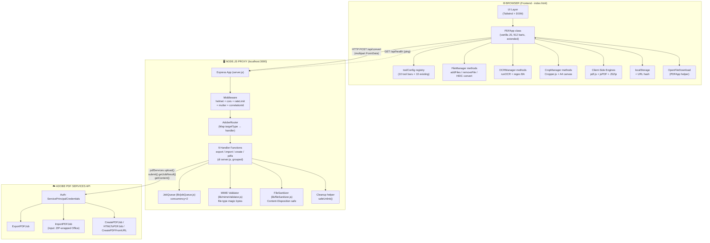

**Karakteristik arsitektur:**
- **Browser = Single Page App** (no framework) — semua navigasi view dilakukan via `PDFApp.show*()`.
- **Server = Thin Proxy** + 3 modul pembantu (`jobQueue`, `mimeValidator`, `fileSanitizer`).
- **Adobe = Black Box** — SDK handle retry internal, OAuth token, asset upload ke Adobe cloud.
- **Tambah tool Adobe baru** = 1 handler function + 1 entry `toolConfig` di frontend + 1 entry `Map` di server.

### 2.2 Data Flow Diagrams

#### 2.2.1 Server-side Conversion (contoh: PDF → Word)


#### 2.2.2 Client-side Conversion (contoh: PDF → JPG)

```mermaid
graph LR
    A["User pilih tool<br/>'PDF ke JPG'"] --> B["Drag/drop file PDF<br/>ke Workspace"]
    B --> C["PDFApp.handleFileList()<br/>→ push ke files[]"]
    C --> D{"Halaman > 50?"}
    D -->|Ya| E["Konfirmasi user"]
    D -->|Tidak| F["User klik 'Ekstrak'"]
    E --> F
    F --> G["PDFApp.processTool()<br/>→ processPdfToJpg()"]
    G --> H["pdfjsLib.getDocument(arrayBuffer)"]
    H --> I["Loop tiap halaman i"]
    I --> J["page.render<br/>scale 2.0 → canvas"]
    J --> K["canvas.toBlob<br/>image/jpeg, 0.92"]
    K --> L{"Multi-page?"}
    L -->|Ya| M["JSZip.file<br/>(page-i.jpg)"]
    L -->|Tidak| N["saveAs<br/>(xxx_page-1.jpg)"]
    M --> O["zip.generateAsync"]
    O --> P["saveAs<br/>(xxx_pages.zip)"]
    N --> Q["setDownloadResult<br/>+ confetti"]
    P --> Q
    Q --> R["Show Download View"]
```

#### 2.2.3 Smart Scan A4 + OCR + Deteksi BA

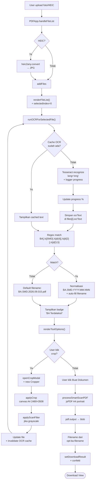

#### 2.2.4 Backend Request Lifecycle

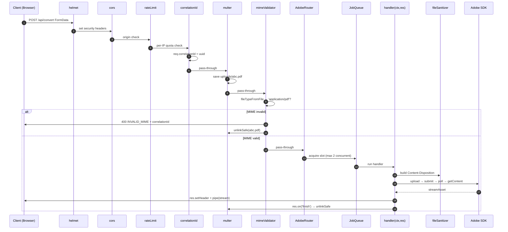

---

## 3. Component Design

### 3.1 Arsitektur Komponen

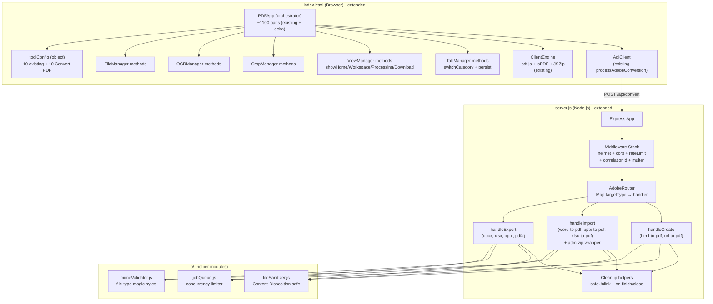

### 3.2 Backend File Structure

```
hazeverter-server/
├── server.js                  # Entry point (extended dari 95 → ~280 baris)
├── package.json               # +helmet, +express-rate-limit, +file-type, +adm-zip
├── .env                       # ADOBE_CLIENT_ID, ADOBE_CLIENT_SECRET, PORT
├── uploads/                   # Multer disk storage (existing)
├── lib/
│   ├── jobQueue.js            # Concurrency limiter (p-limit style, ~40 baris)
│   ├── mimeValidator.js       # file-type wrapper (~30 baris)
│   └── fileSanitizer.js       # path.basename + whitelist + UTF-8 encode (~50 baris)
├── index.html                 # Extended (~1100 baris, +tab nav, +banner, +10 toolConfig entries)
└── README.md                  # (existing)
```

**Alasan struktur sederhana:** Codebase saat ini 95 baris `server.js` + 912 baris `index.html`. Refactor ke struktur `src/{config,middleware,routes,services,plugins}/` (seperti v2) adalah ~25 file baru — overhead tidak sebanding dengan 8 handler baru. Helper module `lib/` sudah cukup.

### 3.3 Component: Backend `AdobeRouter` (Strategy Pattern di `server.js`)

**Lokasi:** `server.js` — postgres-style dispatch via `Map`.

**Struktur:**
```javascript
// Pseudocode
const AdobHandlers = new Map();

AdobeHandlers.set('docx',         handleExportDocx);   // existing
AdobeHandlers.set('xlsx',         handleExportXlsx);   // existing
AdobeHandlers.set('pptx',         handleExportPptx);   // NEW
AdobeHandlers.set('pdfa',         handleExportPdfa);   // NEW (PDF/A-2B)
AdobeHandlers.set('word-to-pdf',  handleImportDocx);   // NEW (ImportPDFJob + adm-zip)
AdobeHandlers.set('pptx-to-pdf',  handleImportPptx);   // NEW
AdobeHandlers.set('xlsx-to-pdf',  handleImportXlsx);   // NEW
AdobeHandlers.set('html-to-pdf',  handleHtmlToPdf);    // NEW (CreatePDFJob)
AdobeHandlers.set('url-to-pdf',   handleUrlToPdf);     // NEW (CreatePDFFromURL)

app.post('/api/convert', upload.single('file'), async (req, res) => {
  const correlationId = req.correlationId;
  const handler = AdobeHandlers.get(req.body.targetType);
  if (!handler) {
    safeUnlink(req.file?.path);
    return res.status(400).json({
      error: `Format target tidak didukung: ${req.body.targetType}`,
      code: 'UNSUPPORTED_TARGET',
      correlationId,
    });
  }
  try {
    await handler(req, res, correlationId);
  } catch (err) {
    console.error(`[${correlationId}] handler error:`, err.stack);
    safeUnlink(req.file?.path);
    if (!res.headersSent) {
      res.status(500).json({
        error: 'Gagal memproses konversi. Silakan coba lagi.',
        code: 'INTERNAL_ERROR',
        correlationId,
      });
    }
  }
});
```

**Tambah tool baru:** 1 entry `AdobeHandlers.set()` + 1 handler function + (jika Adobe) tambah job class ke import + 1 entry `toolConfig` di frontend + 1 card di HTML.

### 3.4 Component: Backend `handleExport` (Generic PDF → Office/PDFA)

**Signature:**
```javascript
async function handleExportDocx(req, res, correlationId) {
  // Tipe: ExportPDFJob + ExportPDFTargetFormat.DOCX
  const params = new ExportPDFParams({ targetFormat: ExportPDFTargetFormat.DOCX });
  return runAdobeExport({ req, res, params, correlationId, ext: 'docx',
    contentType: 'application/vnd.openxmlformats-officedocument.wordprocessingml.document' });
}

async function handleExportPptx(req, res, correlationId) {
  // PPTX fallback per Req 3.5: cek constant exists
  if (typeof ExportPDFTargetFormat.PPTX === 'undefined') {
    safeUnlink(req.file.path);
    return res.status(501).json({
      error: 'Format PowerPoint belum didukung oleh konfigurasi SDK saat ini.',
      code: 'NOT_IMPLEMENTED',
      correlationId,
    });
  }
  const params = new ExportPDFParams({ targetFormat: ExportPDFTargetFormat.PPTX });
  return runAdobeExport({ req, res, params, correlationId, ext: 'pptx',
    contentType: 'application/vnd.openxmlformats-officedocument.presentationml.presentation' });
}

async function handleExportPdfa(req, res, correlationId) {
  const params = new ExportPDFParams({
    targetFormat: ExportPDFTargetFormat.PDF,
    pdfaConformanceLevel: 'LEVEL_2_B',
  });
  return runAdobeExport({ req, res, params, correlationId, ext: 'pdf',
    contentType: 'application/pdf', suffix: '_PDFA' });
}

async function runAdobeExport({ req, res, params, correlationId, ext, contentType, suffix = '' }) {
  const inputFilePath = req.file.path;
  const originalName = req.file.originalname.replace(/\.pdf$/i, '');

  // JobQueue untuk concurrency limiting
  const result = await jobQueue.run(async () => {
    const readStream = fs.createReadStream(inputFilePath);
    const inputAsset = await pdfServices.upload({ readStream, mimeType: 'application/pdf' });
    const job = new ExportPDFJob({ inputAsset, params });
    const pollingURL = await pdfServices.submit({ job });
    const response = await pdfServices.getJobResult({ pollingURL, resultType: ExportPDFResult });
    return response.result.asset;
  });

  const streamAsset = await pdfServices.getContent({ asset: result });

  res.setHeader('Content-Type', contentType);
  res.setHeader('Content-Disposition',
    fileSanitizer.buildDisposition(originalName + suffix, ext));
  res.setHeader('X-Correlation-Id', correlationId);

  streamAsset.readStream.pipe(res);
  streamAsset.readStream.on('end', () => safeUnlink(inputFilePath));
  res.on('close', () => safeUnlink(inputFilePath));
}
```

### 3.5 Component: Backend `handleImport*` (Office → PDF via ImportPDFJob + ZIP wrapper)

**Catatan Penting (dari riset v2, Lampiran A):**
ImportPDFJob di Adobe SDK v4.x butuh input dalam format ZIP wrapper untuk Office formats (DOCX/PPTX/XLSX). Library `adm-zip` digunakan.

```javascript
const AdmZip = require('adm-zip');
const os = require('os');
const path = require('path');

async function wrapOfficeToZip(filePath) {
  // Buat ZIP wrapper untuk ImportPDFJob
  const tmpZipPath = path.join(os.tmpdir(), `import_${Date.now()}_${Math.random().toString(36).slice(2)}.zip`);
  const zip = new AdmZip();
  zip.addLocalFile(filePath);  // tambahkan DOCX/PPTX/XLSX sebagai entry ZIP
  zip.writeZip(tmpZipPath);
  return tmpZipPath;
}

async function handleImportDocx(req, res, correlationId) {
  // Validasi MIME sudah oleh mimeValidator (application/vnd.openxmlformats-officedocument.wordprocessingml.document)
  const inputFilePath = req.file.path;
  const originalName = req.file.originalname.replace(/\.(docx|pptx|xlsx)$/i, '');
  const zipPath = await wrapOfficeToZip(inputFilePath);
  safeUnlink(inputFilePath); // hapus original, kita pakai zip

  const result = await jobQueue.run(async () => {
    const readStream = fs.createReadStream(zipPath);
    const inputAsset = await pdfServices.upload({ readStream, mimeType: 'application/zip' });
    const params = new ImportPDFParams({});
    const job = new ImportPDFJob({ inputAsset, params });
    const pollingURL = await pdfServices.submit({ job });
    const response = await pdfServices.getJobResult({ pollingURL, resultType: ImportPDFResult });
    return response.result.asset;
  });

  const streamAsset = await pdfServices.getContent({ asset: result });
  res.setHeader('Content-Type', 'application/pdf');
  res.setHeader('Content-Disposition', fileSanitizer.buildDisposition(originalName, 'pdf'));
  res.setHeader('X-Correlation-Id', correlationId);
  streamAsset.readStream.pipe(res);
  streamAsset.readStream.on('end', () => safeUnlink(zipPath));
  res.on('close', () => safeUnlink(zipPath));
}

// Sama untuk handleImportPptx dan handleImportXlsx (pattern identik)
```

### 3.6 Component: Backend `handleHtmlToPdf` & `handleUrlToPdf`

```javascript
const { CreatePDFJob, HTMLToPDFJob } = require('@adobe/pdfservices-node-sdk');

async function handleHtmlToPdf(req, res, correlationId) {
  const inputFilePath = req.file.path;
  const originalName = req.file.originalname.replace(/\.html?$/i, '') || 'webpage';

  const result = await jobQueue.run(async () => {
    const readStream = fs.createReadStream(inputFilePath);
    const inputAsset = await pdfServices.upload({ readStream, mimeType: 'text/html' });
    const job = new HTMLToPDFJob({ inputAsset });
    const pollingURL = await pdfServices.submit({ job });
    const response = await pdfServices.getJobResult({ pollingURL, resultType: HTMLToPDFResult });
    return response.result.asset;
  });

  const streamAsset = await pdfServices.getContent({ asset: result });
  res.setHeader('Content-Type', 'application/pdf');
  res.setHeader('Content-Disposition', fileSanitizer.buildDisposition(originalName, 'pdf'));
  res.setHeader('X-Correlation-Id', correlationId);
  streamAsset.readStream.pipe(res);
  streamAsset.readStream.on('end', () => safeUnlink(inputFilePath));
  res.on('close', () => safeUnlink(inputFilePath));
}

async function handleUrlToPdf(req, res, correlationId) {
  // URL tidak butuh file upload, tapi FormData masih menyertakan field kosong
  const url = req.body.url;
  if (!url || !/^https?:\/\//.test(url)) {
    return res.status(400).json({
      error: 'URL tidak valid. Harus dimulai dengan http:// atau https://',
      code: 'INVALID_URL',
      correlationId,
    });
  }

  const result = await jobQueue.run(async () => {
    const job = new CreatePDFJob({ inputURL: url });  // SDK CreatePDFJob.fromURL-style
    const pollingURL = await pdfServices.submit({ job });
    const response = await pdfServices.getJobResult({ pollingURL, resultType: CreatePDFResult });
    return response.result.asset;
  });

  const streamAsset = await pdfServices.getContent({ asset: result });

  // Filename dari hostname URL
  let name = 'webpage';
  try {
    const u = new URL(url);
    name = u.hostname.replace(/^www\./, '') || 'webpage';
  } catch {}

  res.setHeader('Content-Type', 'application/pdf');
  res.setHeader('Content-Disposition', fileSanitizer.buildDisposition(name, 'pdf'));
  res.setHeader('X-Correlation-Id', correlationId);
  streamAsset.readStream.pipe(res);
}
```

### 3.7 Component: Backend Middleware Stack

**Urutan middleware (penting):**

```javascript
// 1. helmet — security headers
app.use(helmet({
  contentSecurityPolicy: {
    directives: {
      defaultSrc: ["'self'"],
      scriptSrc: ["'self'", "'unsafe-inline'", "https://cdn.tailwindcss.com", "https://cdnjs.cloudflare.com"],
      styleSrc: ["'self'", "'unsafe-inline'", "https://cdnjs.cloudflare.com", "https://fonts.googleapis.com"],
      fontSrc: ["'self'", "https://fonts.gstatic.com", "https://cdnjs.cloudflare.com"],
      imgSrc: ["'self'", "data:", "blob:"],
      connectSrc: ["'self'", "http://localhost:3000", "http://127.0.0.1:3000"],
    },
  },
  crossOriginEmbedderPolicy: false,  // perlu untuk ObjectURL
}));

// 2. cors — whitelist localhost
app.use(cors({
  origin: [/^http:\/\/(localhost|127\.0\.0\.1):\d+$/],
  methods: ['GET', 'POST'],
  allowedHeaders: ['Content-Type', 'X-Correlation-Id'],
}));

// 3. correlationId — per-request UUID
app.use((req, res, next) => {
  req.correlationId = req.headers['x-correlation-id'] || crypto.randomUUID();
  res.setHeader('X-Correlation-Id', req.correlationId);
  next();
});

// 4. json parser (untuk non-multipart, mis. /api/health)
app.use(express.json({ limit: '1mb' }));

// 5. rate limit — per-IP
const convertLimiter = rateLimit({
  windowMs: 60 * 1000,
  max: 10,
  standardHeaders: true,
  legacyHeaders: false,
  handler: (req, res) => {
    res.status(429).json({
      error: `Batas permintaan tercapai. Coba lagi dalam 60 detik.`,
      code: 'RATE_LIMIT',
      retryAfterSeconds: 60,
      correlationId: req.correlationId,
    });
  },
});

// 6. multer — applied per-route
const upload = multer({
  dest: 'uploads/',
  limits: { fileSize: 100 * 1024 * 1024, files: 1 },
  fileFilter: (req, file, cb) => {
    // Sizing & extension check
    cb(null, true);
  },
});

// Health check (tidak kena rate limit)
app.get('/api/health', (req, res) => {
  res.json({
    status: 'ok',
    adobeCredentialsValid: !!(ADOBE_CLIENT_ID && ADOBE_CLIENT_SECRET),
    uptimeSeconds: process.uptime(),
    timestamp: new Date().toISOString(),
  });
});
```

### 3.8 Component: `lib/jobQueue.js` — Concurrency Limiter

```javascript
class JobQueue {
  constructor({ concurrency = 2 } = {}) {
    this.concurrency = concurrency;
    this.active = 0;
    this.queue = [];
  }

  run(fn) {
    return new Promise((resolve, reject) => {
      const task = async () => {
        this.active++;
        try { resolve(await fn()); }
        catch (err) { reject(err); }
        finally {
          this.active--;
          this._next();
        }
      };
      if (this.active < this.concurrency) task();
      else this.queue.push(task);
    });
  }

  _next() {
    if (this.queue.length > 0 && this.active < this.concurrency) {
      const next = this.queue.shift();
      next();
    }
  }
}

module.exports = new JobQueue({ concurrency: 2 });
```

**Tujuan:** Cegah Adobe rate-limit saat user submit beberapa konversi bersamaan. Concurrency=2 cukup untuk single-user; configurable via env.

### 3.9 Component: `lib/mimeValidator.js` — Magic Bytes Check

```javascript
const { fileTypeFromFile } = require('file-type');
const { safeUnlink } = require('./cleanup');  // atau inline

const ALLOWED_BY_TARGET = {
  'docx': ['application/pdf'],
  'xlsx': ['application/pdf'],
  'pptx': ['application/pdf'],
  'pdfa': ['application/pdf'],
  'word-to-pdf': ['application/vnd.openxmlformats-officedocument.wordprocessingml.document'],
  'pptx-to-pdf': ['application/vnd.openxmlformats-officedocument.presentationml.presentation'],
  'xlsx-to-pdf': ['application/vnd.openxmlformats-officedocument.spreadsheetml.sheet'],
  'html-to-pdf': ['text/html'],
};

async function validateMime(req, res, next) {
  if (!req.file) return next();
  const targetType = req.body.targetType;
  const allowed = ALLOWED_BY_TARGET[targetType];
  if (!allowed) return next(); // router akan reject unknown target

  try {
    const detected = await fileTypeFromFile(req.file.path);
    const actualMime = detected?.mime || 'application/octet-stream';

    if (!allowed.includes(actualMime)) {
      safeUnlink(req.file.path);
      return res.status(400).json({
        error: `Format file tidak didukung. Terdeteksi: ${actualMime}. Diizinkan: ${allowed.join(', ')}`,
        code: 'INVALID_MIME',
        correlationId: req.correlationId,
      });
    }
    req.file.detectedMime = actualMime;
    next();
  } catch (err) {
    safeUnlink(req.file.path);
    next(err);
  }
}

module.exports = validateMime;
```

### 3.10 Component: `lib/fileSanitizer.js` — Content-Disposition Builder

```javascript
const path = require('path');

const FileSanitizer = {
  /**
   * Build RFC 5987-compliant Content-Disposition
   * @param {string} originalName - nama asli (sudah termasuk basename)
   * @param {string} outputExt - ekstensi output (docx, pdf, dll)
   */
  buildDisposition(originalName, outputExt) {
    const baseName = this.sanitize(originalName).replace(/\.[^.]+$/, '');
    const finalName = `${baseName}.${outputExt}`;
    const encoded = encodeURIComponent(finalName);
    return `attachment; filename="${this._escapeQuotes(finalName)}"; filename*=UTF-8''${encoded}`;
  },

  sanitize(filename) {
    if (!filename || typeof filename !== 'string') return 'file';
    let name = path.basename(filename);
    name = name.replace(/[\x00-\x1f\x7f]/g, '');      // null bytes & control chars
    name = name.replace(/[<>:"/\\|?*]/g, '_');         // Windows-unsafe chars
    name = name.replace(/^\.+/, '');                   // leading dots
    name = name.trim() || 'file';
    if (name.length > 200) name = name.slice(0, 200);
    return name;
  },

  _escapeQuotes(str) {
    return str.replace(/"/g, '\\"').replace(/\\/g, '\\\\');
  },
};

module.exports = FileSanitizer;
```

### 3.11 Component: Backend `safeUnlink`

```javascript
// Inline di server.js (sederhana, tidak perlu module terpisah)
function safeUnlink(filePath) {
  if (!filePath) return;
  try {
    if (fs.existsSync(filePath)) fs.unlinkSync(filePath);
  } catch (err) {
    console.warn(`[cleanup] failed to unlink ${filePath}:`, err.message);
  }
}
```

### 3.12 Component: Frontend `PDFApp` (Extended, Tidak Refactor)

**Lokasi:** `index.html` `<script>` block (class existing, di-extend dengan delta ~190 baris).

**Delta pada class `PDFApp`:**

```javascript
class PDFApp {
  constructor() {
    // ... existing properties ...
    this.activeCategory = 'all';
    this.serverOnline = true;          // NEW (health check)
    this.toolConfig = {
      // ... existing 10 entries ...
      'pdf-to-ppt': {                  // NEW (existing card HTML sudah ada, tinggal config)
        title: 'Konversi PDF ke PowerPoint (.pptx)',
        subtitle: 'Ubah dokumen PDF menjadi file Microsoft PowerPoint',
        accept: '.pdf',
        icon: 'fa-file-powerpoint',
        btnText: 'Konversi ke PowerPoint (.pptx) →',
        btnBg: 'bg-orange-600 hover:bg-orange-700 shadow-orange-600/20',
        desc: 'Tarik & lepas berkas PDF yang ingin diubah ke PowerPoint di sini',
        btnLabel: 'Pilih Berkas PDF',
        category: 'convert-pdf',
        engine: 'adobe',
        serverTargetType: 'pptx',
      },
      // ... 7 entries Convert PDF baru ...
    };
  }

  // Existing methods (tidak berubah):
  // - selectTool, handleFileList, addFiles, runOCRForSelectedFile, ...
  // - processTool (extended untuk dispatch ke targetType baru)
  // - processAdobeConversion (extended — sudah support semua targetType via server)

  // NEW methods:
  switchCategory(category) {
    this.activeCategory = category;
    this._renderCategoryTabs();
    this._filterAndRenderToolCards();
    localStorage.setItem('hazeverter.lastTab', category);
    history.replaceState(null, '', `#tab=${category}`);
  }

  _renderCategoryTabs() {
    // Toggle kelas active pada pill button
    const pills = document.querySelectorAll('[data-category-pill]');
    pills.forEach(p => p.classList.toggle('active', p.dataset.categoryPill === this.activeCategory));
  }

  _filterAndRenderToolCards() {
    // Tampilkan/sembunyikan card berdasarkan category
    document.querySelectorAll('[data-tool-card]').forEach(card => {
      const toolKey = card.dataset.toolCard;
      const tool = this.toolConfig[toolKey];
      const visible = (this.activeCategory === 'all') || (tool && tool.category === this.activeCategory);
      card.style.display = visible ? '' : 'none';
    });
  }

  async _loadInitialCategory() {
    const hash = window.location.hash.match(/tab=([\w-]+)/);
    if (hash && this._isValidCategory(hash[1])) { this.activeCategory = hash[1]; return; }
    const saved = localStorage.getItem('hazeverter.lastTab');
    if (saved && this._isValidCategory(saved)) { this.activeCategory = saved; return; }
    this.activeCategory = 'all';
  }

  _isValidCategory(c) {
    return ['all','workflows','organize-pdf','optimize-pdf','convert-pdf','edit-pdf','pdf-security','pdf-intelligence'].includes(c);
  }

  async _checkServerHealth() {
    try {
      const res = await fetch('http://localhost:3000/api/health', { cache: 'no-store' });
      this.serverOnline = res.ok;
    } catch {
      this.serverOnline = false;
    }
    this._renderServerBanner();
  }

  _renderServerBanner() {
    // Tampilkan banner kuning jika offline
    const banner = document.getElementById('server-status-banner');
    if (banner) banner.style.display = this.serverOnline ? 'none' : 'flex';
  }
}

// Bootstrap dengan category loading
document.addEventListener('DOMContentLoaded', async () => {
  app = new PDFApp();
  await app._loadInitialCategory();
  app._renderCategoryTabs();
  app._filterAndRenderToolCards();
  app._checkServerHealth();
  setInterval(() => app._checkServerHealth(), 60_000); // ping tiap 60 detik
});
```

### 3.13 Component: Frontend `toolConfig` Registry (10 entries baru)

**Struktur (delta dari existing):**

| Tool Key | Title | Engine | targetType | Accept | Category |
|---|---|---|---|---|---|
| `pdf-to-ppt` *(existing card HTML)* | PDF ke PowerPoint | adobe | `pptx` | `.pdf` | convert-pdf |
| `word-to-pdf` *(existing)* | Word ke PDF | adobe | `word-to-pdf` | `.docx` | convert-pdf |
| `ppt-to-pdf` *(existing)* | PowerPoint ke PDF | adobe | `pptx-to-pdf` | `.pptx` | convert-pdf |
| `excel-to-pdf` *(existing)* | Excel ke PDF | adobe | `xlsx-to-pdf` | `.xlsx` | convert-pdf |
| `html-to-pdf` *(existing)* | HTML/URL ke PDF | adobe | `html-to-pdf` `url-to-pdf` | `.html,.htm,URL` | convert-pdf |
| `pdf-to-pdfa` *(existing)* | PDF ke PDF/A | adobe | `pdfa` | `.pdf` | convert-pdf |
| `pdf-to-jpg` *(existing)* | PDF ke JPG | client | — | `.pdf` | convert-pdf |
| `img-to-pdf` *(existing)* | JPG ke PDF | client | — | `image/*` | convert-pdf |

**Catatan:** Card HTML sudah ada di `index.html` (line 145–267) dengan `onclick="app.selectTool('pdf-to-ppt')"` dll. Yang **baru** adalah:
1. Tambah entry di `toolConfig` untuk semua 10 Convert PDF (existing 8 + 2 sudah di-handle via `processTool` yang sudah extend untuk semua `engine: 'adobe'`).
2. Tambah `category: 'convert-pdf'` agar tab filter menyembunyikan/menampilkan.
3. Tambah `data-tool-card="<key>"` attribute pada card untuk filter.

### 3.14 Component: Frontend `TabManager` (UI Tab Kategori)

**HTML structure (di-insert sebelum `<div class="grid grid-cols-1 sm:grid-cols-2 lg:grid-cols-4 gap-6">` di line 130):**

```html
<div id="category-tabs" class="flex flex-wrap gap-2 mb-6 overflow-x-auto pb-2 scrollbar-thin">
  <button data-category-pill="all" onclick="app.switchCategory('all')"
    class="px-4 py-2 rounded-full text-xs font-bold border transition-colors
           data-[active=true]:bg-brand-600 data-[active=true]:text-white data-[active=true]:border-brand-600
           bg-white text-slate-600 border-slate-200 hover:bg-slate-100">
    All
  </button>
  <button data-category-pill="workflows" onclick="app.switchCategory('workflows')"
    class="...">Workflows</button>
  <button data-category-pill="organize-pdf" onclick="app.switchCategory('organize-pdf')" class="...">Organize PDF</button>
  <button data-category-pill="optimize-pdf" onclick="app.switchCategory('optimize-pdf')" class="...">Optimize PDF</button>
  <button data-category-pill="convert-pdf" onclick="app.switchCategory('convert-pdf')" class="...">Convert PDF</button>
  <button data-category-pill="edit-pdf" onclick="app.switchCategory('edit-pdf')" class="...">Edit PDF</button>
  <button data-category-pill="pdf-security" onclick="app.switchCategory('pdf-security')" class="...">PDF Security</button>
  <button data-category-pill="pdf-intelligence" onclick="app.switchCategory('pdf-intelligence')" class="...">PDF Intelligence</button>
</div>

<!-- Banner info Convert PDF -->
<div id="convert-pdf-banner" class="hidden bg-blue-50 border border-blue-200 text-blue-800 px-4 py-3 rounded-xl mb-4 text-sm">
  <i class="fa-solid fa-circle-info mr-2"></i>
  <strong>10 tool konversi dokumen</strong> — 8 via Adobe API (butuh server berjalan) dan 2 client-side (offline).
</div>

<!-- Banner offline -->
<div id="server-status-banner" class="hidden bg-amber-50 border border-amber-300 text-amber-800 px-4 py-3 rounded-xl mb-4 text-sm">
  <i class="fa-solid fa-triangle-exclamation mr-2"></i>
  Mode terbatas: Server Adobe offline. Hanya tool client-side (PDF→JPG, JPG→PDF) yang berfungsi.
</div>
```

**CSS (inline Tailwind, ditambahkan ke `<style>` existing):**
```css
[data-category-pill][data-active="true"] {
  background-color: #2563eb; /* brand-600 */
  color: white;
  border-color: #2563eb;
}
.scrollbar-thin::-webkit-scrollbar { height: 4px; }
.scrollbar-thin::-webkit-scrollbar-thumb { background: #cbd5e1; border-radius: 2px; }
```

---

## 4. Data Model

### 4.1 Core Data Structures

```typescript
// ============= FRONTEND STATE =============

interface AppState {
  currentTool: ToolKey;
  activeCategory: CategoryKey;
  files: FileItem[];
  selectedIndex: number;
  processedResult: string | null;     // blob URL
  processedFileName: string;
  activeTab: 'preview' | 'ocrtext';
  scanMode: 'color' | 'grayscale';
  detectedBaNumber: string;
  serverOnline: boolean;             // healthcheck state
}

interface FileItem {
  file: File;
  url: string;
  originalUrl: string;
  finalName: string;
  sizeMb: string;
  ocrText: string | null;
  cropApplied: boolean;
}

type ToolKey =
  | 'ocr-ba'
  | 'merge' | 'split' | 'compress'
  | 'pdf-to-jpg' | 'img-to-pdf'
  | 'protect' | 'watermark'
  | 'pdf-to-word' | 'pdf-to-excel'
  | 'pdf-to-ppt'           // existing key (alias untuk 'pdf-to-pptx' di v2)
  | 'word-to-pdf' | 'ppt-to-pdf' | 'excel-to-pdf'
  | 'html-to-pdf' | 'pdf-to-pdfa';

type CategoryKey =
  | 'all' | 'workflows' | 'organize-pdf' | 'optimize-pdf'
  | 'convert-pdf' | 'edit-pdf' | 'pdf-security' | 'pdf-intelligence';

interface ToolConfig {
  title: string;
  subtitle: string;
  accept: string;
  icon: string;
  btnText: string;
  btnBg: string;
  desc: string;
  btnLabel: string;
  category: CategoryKey;       // tab kategori
  engine: 'client' | 'adobe';
  serverTargetType?: string;   // salah satu dari AdobeTargetType
  requiresUrl?: boolean;       // untuk url-to-pdf sub-mode
}

interface ConversionRequest {
  file: File;
  targetType: string;
  url?: string;
}

interface ConversionResult {
  blob: Blob;
  filename: string;
  contentType: string;
}

interface ApiError {
  error: string;
  code?: string;
  correlationId?: string;
  retryAfterSeconds?: number;
}

// ============= BACKEND TYPES =============

interface MulterRequest extends Request {
  file?: Express.Multer.File & { detectedMime?: string };
  correlationId?: string;
}

interface AdobeJobContext {
  inputPath: string;
  inputMime: string;
  targetType: string;
  outputMime: string;
  outputExt: string;
  originalName: string;
  correlationId: string;
}

type AdobeTargetType =
  | 'docx' | 'xlsx' | 'pptx' | 'pdfa'
  | 'word-to-pdf' | 'pptx-to-pdf' | 'xlsx-to-pdf'
  | 'html-to-pdf' | 'url-to-pdf';
```

### 4.2 Frontend Class Diagram

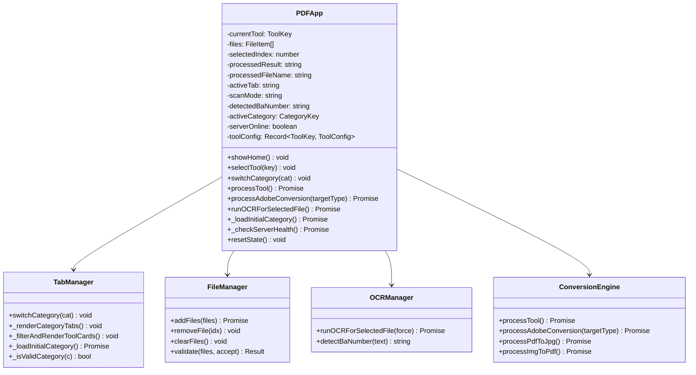

### 4.3 Backend Class/Module Diagram

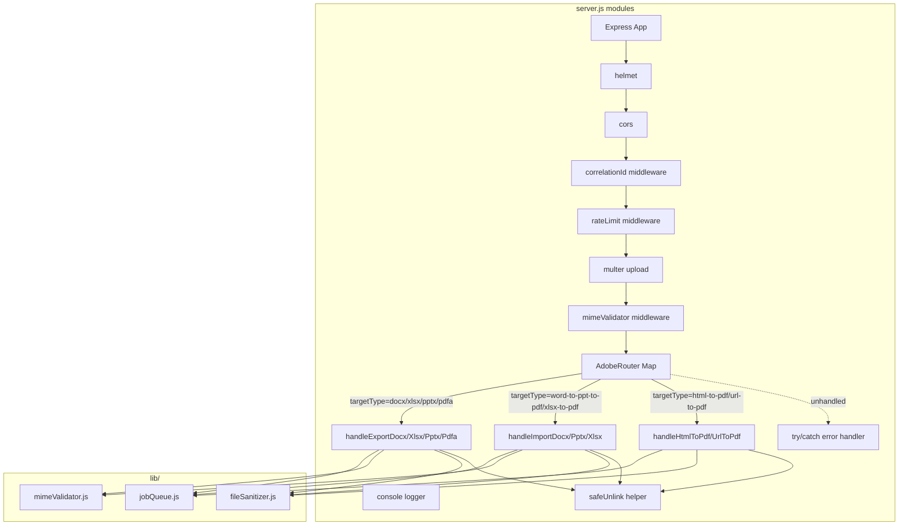

---

## 5. Business Process

### 5.1 Process 1 — PDF ke Word (Server-side)

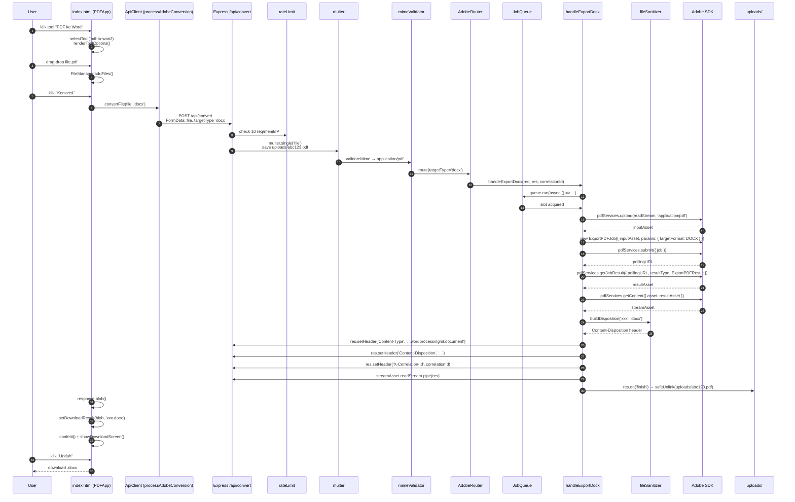

**Progress stage di UI (Req 2.8):**
- 0–20%: "Mengunggah ke Adobe..."
- 20–60%: "Memproses konversi..."
- 60–90%: "Mengunduh hasil..."
- 100%: Done, confetti trigger.

### 5.2 Process 2 — PDF ke JPG (Client-side)

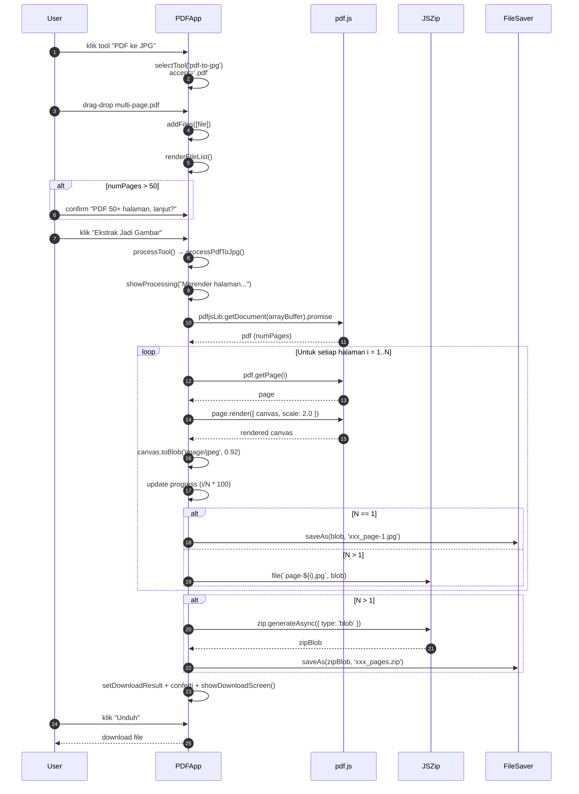

### 5.3 Process 3 — Smart Scan A4 + OCR + BA Detection

```mermaid
flowchart TD
    Start([User pilih tab All atau Convert PDF]) --> A[klik tool<br/>'Smart Scan & Free Crop A4']
    A --> B[selectTool 'ocr-ba']
    B --> C[Tampilkan dropzone<br/>accept image/* + HEIC]
    C --> D{User upload<br/>gambar/HEIC?}
    D -->|HEIC| E[heic2any.convert<br/>→ JPG]
    D -->|JPG/PNG/WEBP| F[FileManager.addFiles]
    E --> F
    F --> G[renderFileList<br/>+ renderToolOptions]
    G --> H[runOCRForSelectedFile]
    H --> I{Ada cache<br/>ocrText?}
    I -->|Ya, tidak force| J[Tampilkan cached text]
    I -->|Tidak atau force| K[Tesseract.recognize<br/>lang='eng'<br/>+ logger progress]
    K --> L[Update progress %]
    L --> M[Simpan ocrText ke<br/>files selectedIndex .ocrText]
    M --> N[Regex BA[./s]SMD ...]
    J --> N
    N --> O{Match?}
    O -->|Ya| P[normalize →<br/>BA.SMD.YYYY.MM.NNN]
    O -->|Tidak| Q[defaultFilename tetap<br/>BA.SMD.2026.09.015.pdf]
    P --> R[Set detectedBaNumber<br/>+ auto-fill input<br/>opt-ba-filename]
    R --> S[Tampilkan badge<br/>BA Terdeteksi!]
    Q --> T[Siap untuk proses]
    S --> T
    T --> U{User klik<br/>crop?}
    U -->|Ya| V[openCropModal<br/>+ new Cropper]
    V --> W[applyCrop<br/>canvas A4 2480×3508]
    W --> X[applyScanFilter<br/>jika grayscale]
    X --> Y[Update file<br/>+ invalidate OCR cache]
    Y --> H
    U -->|Tidak| Z[User klik Buat Dokumen]
    Z --> AA[processSmartScanPDF<br/>jsPDF A4 portrait]
    AA --> AB[Tiap gambar ke canvas<br/>+ filter sesuai scanMode]
    AB --> AC[pdf.addImage page per page]
    AC --> AD[pdf.output → blob]
    AD --> AE[Gunakan filename<br/>dari opt-ba-filename]
    AE --> AF[setDownloadResult<br/>+ confetti]
    AF --> AG([Download View])
```

### 5.4 Process 4 — Tab Navigation & State Management

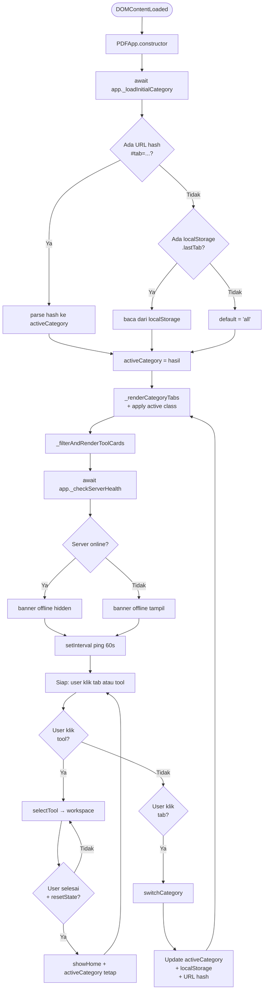

**State persistence rules:**
- `localStorage.hazeverter.lastTab` di-update **setiap** `switchCategory()`.
- URL hash di-update via `history.replaceState()` (tidak menambah history entry).
- Pada reload, prioritas: **URL hash > localStorage > 'all'**.
- Saved state lama di localStorage yang bukan `CategoryKey` valid → diabaikan gracefully (Req 22.5).

### 5.5 Process 5 — Error Recovery Flowchart

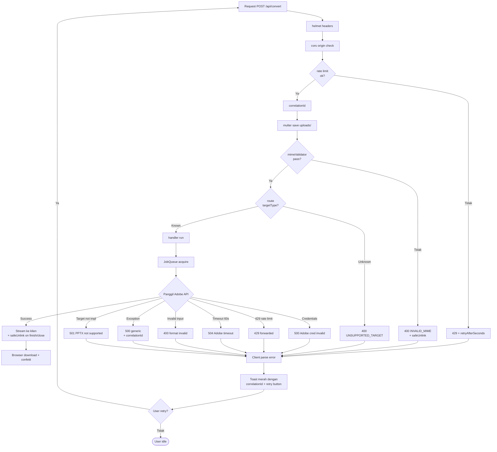

---

## 6. Error Handling Strategy

### 6.1 Kategori Error

| Kategori | HTTP Code | Source | Contoh Pesan (ID) | Recovery |
|---|---|---|---|---|
| **E1. Adobe Credential Invalid** | 500 | Server (boot/runtime) | "Kredensial Adobe tidak valid. Periksa file .env" | Server tetap start, warning. Endpoint return 500 + correlationId. Banner info tampil di UI. |
| **E2. Adobe API Rate Limit** | 429 | Adobe SDK | "Batas permintaan tercapai. Coba lagi dalam 60 detik." | Frontend tampilkan retry dengan countdown timer. |
| **E3. Adobe API Timeout** | 504 | Server (AbortController di JobQueue) | "Adobe API timeout. Silakan coba lagi." | Cleanup file, return 504 + correlationId. |
| **E4. File Validation (MIME)** | 400 | mimeValidator (magic bytes) | "Format file tidak didukung. Terdeteksi: application/x-msdownload." | Frontend filter dropzone + server re-validate. |
| **E5. File Size Limit** | 413 | Multer `limits.fileSize` | "File terlalu besar. Maksimal 100 MB." | Frontend pre-check via `file.size` sebelum upload. |
| **E6. Target Type Unknown** | 400 | Router dispatch | "Format target tidak didukung: {targetType}" | Logged, return 400 + correlationId. |
| **E7. PPTX Not Implemented** | 501 | handleExportPptx (fallback check) | "Format PowerPoint belum didukung oleh konfigurasi SDK saat ini." | Per Req 3.5. |
| **E8. URL Tidak Valid** | 400 | handleUrlToPdf | "URL tidak valid. Harus dimulai dengan http:// atau https://" | Frontend tampilkan retry dengan URL field editable. |
| **E9. Adobe Exception Unknown** | 500 | Server catch-all | "Gagal memproses konversi. Silakan coba lagi." | Log full stack trace di server + correlationId. Generic message ke klien. |
| **E10. Network Error (Server Offline)** | n/a | Browser fetch | "Server proxy Adobe tidak berjalan. Jalankan `node server.js`." | Frontend health check setiap 60s + banner offline. |
| **E11. OCR Engine Error** | n/a | tesseract.js | "Gagal memproses OCR pada file ini." | Retry button. File tetap di antrean. |
| **E12. Client-side Conversion Error** | n/a | pdf.js / jsPDF | "Gagal memproses gambar. File mungkin corrupt." | Retry button. Clear affected file. |
| **E13. Disk Cleanup Error** | n/a | fs.unlink | (silent, log only) | Tidak ganggu user flow. |

### 6.2 Error Handling Pattern — Server

```javascript
// Pseudocode central error handler (inline di endpoint /api/convert)
app.post('/api/convert', convertLimiter, upload.single('file'), validateMime, async (req, res) => {
  const correlationId = req.correlationId;
  const targetType = req.body.targetType;

  const handler = AdobeHandlers.get(targetType);
  if (!handler) {
    safeUnlink(req.file?.path);
    return res.status(400).json({
      error: `Format target tidak didukung: ${targetType}`,
      code: 'UNSUPPORTED_TARGET',
      correlationId,
    });
  }

  try {
    await handler(req, res, correlationId);
  } catch (err) {
    console.error(`[${correlationId}] handler error:`, err.stack);
    safeUnlink(req.file?.path);
    if (!res.headersSent) {
      // Map known errors
      if (err.code === 'RATE_LIMIT' || err.statusCode === 429) {
        return res.status(429).json({
          error: `Batas permintaan Adobe tercapai. Coba lagi dalam ${err.retryAfterSeconds || 60} detik.`,
          code: 'RATE_LIMIT',
          retryAfterSeconds: err.retryAfterSeconds || 60,
          correlationId,
        });
      }
      if (err.code === 'TIMEOUT' || err.statusCode === 504) {
        return res.status(504).json({
          error: 'Adobe API timeout. Silakan coba lagi.',
          code: 'TIMEOUT',
          correlationId,
        });
      }
      // Generic 500
      res.status(500).json({
        error: 'Gagal memproses konversi. Silakan coba lagi.',
        code: 'INTERNAL_ERROR',
        correlationId,
      });
    }
  }
});
```

### 6.3 Error Handling Pattern — Frontend

```javascript
// Pseudocode di PDFApp.processAdobeConversion
async processAdobeConversion(targetType) {
  const formData = new FormData();
  formData.append('file', this.files[0].file);
  formData.append('targetType', targetType);

  let response;
  try {
    response = await fetch('http://localhost:3000/api/convert', {
      method: 'POST',
      body: formData,
    });
  } catch (networkErr) {
    this.serverOnline = false;
    this._renderServerBanner();
    throw new Error('Server proxy Adobe tidak berjalan. Jalankan `node server.js` di terminal.');
  }

  if (!response.ok) {
    const err = await response.json().catch(() => ({}));
    const cid = response.headers.get('X-Correlation-Id') || err.correlationId || '';
    const shortCid = cid ? ` [ref: ${cid.slice(0, 8)}]` : '';
    throw new Error(`${err.error || `HTTP ${response.status}`}${shortCid}`);
  }

  const blob = await response.blob();
  // ... setDownloadResult ...
}
```

**UI error display (sesuai Req 16.8):**
- Toast merah auto-dismiss 5 detik atau tombol close manual.
- Tombol "Coba Lagi" mempertahankan file di antrean (tidak clear `files[]`).
- Server correlation ID ditampilkan sebagai 8-char prefix untuk support.

### 6.4 Recovery Mechanism

| Skenario | Mekanisme |
|---|---|
| Adobe SDK timeout | JobQueue timeout 60s → throw TIMEOUT → 504 |
| Adobe rate limit | JobQueue respects quota; express-rate-limit returning 429 |
| Server crash mid-upload | `res.on('close')` listener → `safeUnlink(req.file.path)` |
| File corrupt (MIME mismatch) | mimeValidator reject sebelum upload ke Adobe |
| Browser tab closed mid-process | Download view tetap punya blob URL sampai reload |
| Orphan file di `uploads/` | Manual cleanup (dokumentasikan di README) |

---

## 7. Testing Strategy

### 7.1 Pendekatan Testing per Komponen

| Komponen | Jenis Test | Tools | Coverage Target |
|---|---|---|---|
| **AdobeRouter dispatch** | Unit (Node.js) | `node:test` built-in | 100% branches |
| **Handler functions** | Integration | Manual + curl script | Happy path + 1 error per handler |
| **multer file filter** | Unit | `node:test` | Size limit, single file |
| **mimeValidator** | Unit | `node:test` + sample files | PDF/DOCX/XLSX/PPTX/HTML detection |
| **fileSanitizer** | Unit | `node:test` | Path traversal, null bytes, control chars |
| **jobQueue** | Unit | `node:test` | Concurrency limit, FIFO |
| **helmet/cors/rateLimit** | Integration | curl | Headers, 429 |
| **PDFApp.selectTool** | Manual browser | `index.html` | Semua tool keys render tanpa error |
| **FileManager (HEIC convert)** | Integration | Manual di browser | HEIC → JPG sukses |
| **OCRManager + BA regex** | Unit | `node:test` extract | 10+ variasi input OCR → expected pattern |
| **CropManager (A4 canvas)** | Integration | Manual di browser | Crop → A4 dimensi + filter |
| **E2E PDF→Word** | E2E | Manual curl + browser | Sample PDF → .docx valid |
| **Tab state persistence** | Manual | Reload test | URL hash > localStorage > 'all' |
| **Backward compatibility** | Smoke | Manual: klik setiap tool existing | Semua 9 tool existing berfungsi identik |

### 7.2 Test Cases Prioritas Tinggi

**Backend:**
1. `POST /api/convert` dengan `targetType=docx` + valid PDF → 200 + .docx stream.
2. `POST /api/convert` tanpa file → 400 "Tidak ada file".
3. `POST /api/convert` dengan targetType invalid → 400 "Format target tidak didukung".
4. `POST /api/convert` dengan file > 100 MB → 413.
5. Rate limit: 11 request cepat → request ke-11 return 429 + retryAfterSeconds.
6. Adobe credentials missing → server boot warning, endpoint return 500 + correlationId.
7. MimeValidator: `.exe` renamed `.pdf` → 400 INVALID_MIME.
8. fileSanitizer: `../../etc/passwd` → `passwd.pdf`.

**Frontend:**
1. Buka halaman, default tab = 'all', 19+ tool tampil.
2. Klik tab "Convert PDF" → tepat 10 tool tampil.
3. Refresh halaman dengan `#tab=convert-pdf` → tab tetap Convert PDF.
4. Upload HEIC → otomatis konversi ke JPG.
5. Smart Scan A4 + OCR → regex BA terdeteksi dari "BA.SMD.2026.09.015".
6. Klik crop → modal Cropper.js → apply crop → OCR cache cleared.
7. Proses PDF→Word → download .docx valid → confetti muncul.
8. Proses PDF→JPG multi-page → download .zip berisi N file JPG.
9. Server offline (stop `node server.js`) → banner kuning tampil + tool Adobe pesan error.
10. Mobile viewport (≤640px) → tab di belakang scroll horizontal, grid 1 kolom.

### 7.3 Tools

- **Backend unit test:** native `node:test` (zero dependency).
- **HTTP test:** `curl` script di `tests/integration.sh` (commit ke repo).
- **Frontend manual:** checklist di `tests/MANUAL_CHECKLIST.md`.

---

## 8. Migration & Backward Compatibility

### 8.1 Strategi Migrasi

Pendekatan: **incremental extension** — tidak ada breaking change.

**Urutan implementasi:**
1. **Backend** (reversible): Tambah handler baru di `server.js` tanpa menghapus logic existing. Tambah helper `lib/{jobQueue,mimeValidator,fileSanitizer}.js`. Tambah `helmet`, `rateLimit`, `file-type`, `adm-zip` ke `package.json`.
2. **Frontend registry**: Tambah entry baru di `toolConfig` (existing 10 + 8 server-side baru = 18, + 2 client-side).
3. **Tab navigasi**: Tambah `<div id="category-tabs">` di Home view, tanpa mengubah existing `<div class="grid grid-cols-1 sm:grid-cols-2 lg:grid-cols-4 gap-6">`.
4. **Banner info**: Tambah 2 banner (info Convert PDF + offline server).
5. **Tool cards baru**: Tambah `data-tool-card` attribute pada setiap card (existing 10 + 8 Convert PDF baru).

### 8.2 Backward Compatibility Checklist

| Aspek | Strategi Preserve |
|---|---|
| **Element IDs** (`app`, `view-home`, `view-workspace`, `view-processing`, `view-download`, `crop-modal`, `ocr-preview-tabs`) | Tidak diubah. ID baru (`category-tabs`, `server-status-banner`, `convert-pdf-banner`) dibuat unik. |
| **Class names penting** (`tool-card`, `dropzone-dash`, `scanner-laser`, `filter-grayscale-scan`, `custom-scrollbar`) | Tidak diubah. |
| **Global `app` instance** | `let app; window.addEventListener('DOMContentLoaded', ...)` — tidak berubah. Existing `onclick="app.selectTool('xxx')"` masih berfungsi. |
| **Tool key existing** (`ocr-ba`, `merge`, `split`, `compress`, `pdf-to-jpg`, `img-to-pdf`, `protect`, `watermark`, `pdf-to-word`, `pdf-to-excel`, `pdf-to-ppt`, `word-to-pdf`, `ppt-to-pdf`, `excel-to-pdf`, `html-to-pdf`, `pdf-to-pdfa`) | Tidak diubah. (Card HTML sudah ada di line 145-267, hanya tambah `data-tool-card` attribute dan `category` di config.) |
| **localStorage existing** | Tidak ada conflict. Key baru: `hazeverter.lastTab`. |
| **API endpoint** | Hanya `POST /api/convert` + `GET /api/health`. Tidak ada endpoint existing yang diubah. |
| **HEIC handling** | Tidak berubah. `heic2any` di FileManager tetap dipanggil. |
| **OCR + BA regex** | Tidak berubah. Regex `/BA[.\/\s]SMD[.\/\s]\d{4}[.\/\s]\d{2}[.\/\s]\d{3,5}/i` tetap. |
| **Crop modal + scanner laser** | Tidak berubah. Tombol "Simulasi Sinar Laser" + animasi 3 detik tetap. |
| **A4 canvas dimensi (2480×3508)** | Tidak berubah. Crop output selalu A4 portrait. |
| **Download view + confetti** | Tidak berubah. |

### 8.3 Data Migration

- **Tidak ada migrasi data user-side.** localStorage hanya tambah key baru.
- **Tidak ada migrasi file.** `uploads/` folder tetap; cleanup strategy sama.
- **Environment variables:** Hanya 3 existing (`ADOBE_CLIENT_ID`, `ADOBE_CLIENT_SECRET`, `PORT`) — tidak ada env baru.

### 8.4 Rollback Plan

1. **Frontend rollback:** Restore `index.html` dari git. Karena additive, tidak perlu touch file lain.
2. **Backend rollback:** Restore `server.js` dari git. Hapus folder `lib/`.
3. **No database migration** → rollback instan tanpa data loss.

---

## 9. Security Hardening

### 9.1 Defense Layers (8-layer, dari v2)

```
┌─────────────────────────────────────────┐
│ Layer 1: Network (Helmet + CORS)         │
├─────────────────────────────────────────┤
│ Layer 2: Rate Limit (per-IP)            │
├─────────────────────────────────────────┤
│ Layer 3: Size Limit (Multer 100MB)      │
├─────────────────────────────────────────┤
│ Layer 4: MIME Validation (Magic Bytes)   │
├─────────────────────────────────────────┤
│ Layer 5: Filename Sanitization          │
├─────────────────────────────────────────┤
│ Layer 6: Content-Disposition Safe       │
├─────────────────────────────────────────┤
│ Layer 7: Streaming + Cleanup (3 jalur)   │
├─────────────────────────────────────────┤
│ Layer 8: Correlation ID + Log Hygiene    │
└─────────────────────────────────────────┘
```

### 9.2 Threat Model

| Threat | Vector | Mitigation |
|---|---|---|
| Malicious file upload | Upload EXE disguised as PDF | Layer 4 (magic bytes via file-type) |
| Path traversal | Nama file `../../etc/passwd` | Layer 5-6 (sanitize + basename) |
| DoS via large file | Upload 10 GB | Layer 3 (multer 100MB cap) |
| Rate limit abuse | 1000 req/sec | Layer 2 (express-rate-limit 10/min/IP) |
| CORS bypass | Origin attacker.com | Layer 1 (regex whitelist localhost:*) |
| XSS via filename | `<script>alert(1)</script>.pdf` | Layer 5-6 (whitelist + escape) |
| Header injection | `\r\n` di filename | Layer 5 (control char strip) |
| Brute force Adobe creds | Try random creds | Adobe SDK handles auth internally |
| Server overload via concurrent requests | 10 parallel PDF→Word | JobQueue concurrency=2 |

### 9.3 Implementasi Per Layer

**Layer 1 — Helmet + CORS:** Section 3.7 di atas.
**Layer 2 — Rate Limit:** Section 3.7 di atas.
**Layer 3 — Size Limit:** `multer({ limits: { fileSize: 100 * 1024 * 1024, files: 1 } })`.
**Layer 4 — MIME Magic Bytes:** `lib/mimeValidator.js` (Section 3.9).
**Layer 5-6 — Filename Sanitization:** `lib/fileSanitizer.js` (Section 3.10).
**Layer 7 — Streaming + Cleanup:** `streamAsset.readStream.pipe(res)` + `res.on('finish'|'close') → safeUnlink` di setiap handler.
**Layer 8 — Correlation ID + Log Hygiene:**
- `crypto.randomUUID()` per request → `req.correlationId`.
- Set di response header `X-Correlation-Id`.
- Include di semua `console.error`.
- **JANGAN log:** API keys, file binary content, full stack trace ke klien.
- **Boleh log:** correlationId, file metadata (name/size/MIME), error message, duration, status code.

### 9.4 Security Checklist Implementasi

- [ ] Helmet aktif dengan CSP longgar untuk CDN libs.
- [ ] CORS whitelist `localhost:*` & `127.0.0.1:*`.
- [ ] Rate limit 10 req/menit per-IP di `/api/convert`.
- [ ] Multer `fileSize: 100MB` hard cap.
- [ ] MIME magic bytes validation via `file-type`.
- [ ] Filename sanitization dengan `path.basename` + whitelist.
- [ ] Content-Disposition dengan escaped quotes + UTF-8 encoding (RFC 5987).
- [ ] Streaming response (no buffer).
- [ ] Cleanup file temp di `finish`, `close`, dan catch block.
- [ ] `.env` di `.gitignore`.
- [ ] Generic error messages ke klien (no stack trace leak).
- [ ] Correlation ID (8-char prefix) di setiap error response user-facing.

---

## 10. Referensi & Lampiran

### 10.1 Riset Adobe PDF Services SDK v4.1.0

**Sumber:** [npm @adobe/pdfservices-node-sdk](https://www.npmjs.com/package/@adobe/pdfservices-node-sdk) (v4.1.0), [Adobe PDF Services API docs](https://developer.adobe.com/document-services/docs/overview/pdf-services-api/).

**Jobs yang digunakan:**
- `ExportPDFJob` — PDF → DOCX, XLSX, PPTX (ExportPDFTargetFormat enum)
- `ImportPDFJob` — DOCX/PPTX/XLSX/ZIP → PDF (perlu ZIP wrapper untuk Office formats)
- `HTMLToPDFJob` — HTML → PDF
- `CreatePDFJob` (alternatif untuk URL via `CreatePDFFromURL`)

**ExportPDFParams options:**
- `targetFormat` — enum (`DOCX` | `XLSX` | `PPTX` | `PDF`)
- `includeAnnotations` (boolean, default true)
- `pdfaConformanceLevel` — `'LEVEL_1_B' | 'LEVEL_2_B' | 'LEVEL_2_U' | 'LEVEL_3_B' | 'LEVEL_3_U'`

**Key findings:**
1. **ImportPDFJob butuh ZIP wrapper** untuk DOCX/PPTX/XLSX — `adm-zip` library digunakan.
2. **PPT format**: `ExportPDFTargetFormat.PPTX` tersedia di SDK v4.x; tetap pakai fallback check per Req 3.5 untuk safety.
3. **PDF/A conformance**: gunakan `pdfaConformanceLevel: 'LEVEL_2_B'` (PDF/A-2B) per Req 11.2.
4. **Polling**: SDK melempar exception selama job in-progress; perlu retry loop.
5. **Streaming**: `pdfServices.getContent()` mengembalikan `streamAsset` dengan `readStream` yang bisa di-pipe langsung ke HTTP response.

### 10.2 Backend Dependencies (Final)

**Existing:**
- `@adobe/pdfservices-node-sdk@^4.1.0`
- `express@^5.2.1`
- `multer@^2.3.0`
- `cors@^2.8.6`
- `dotenv@^17.4.2`

**Baru:**
- `helmet@^8.0.0` — security headers
- `express-rate-limit@^7.4.0` — rate limiting per-IP
- `file-type@^16.5.0` — MIME magic bytes detection
- `adm-zip@^0.5.0` — ZIP wrapper untuk ImportPDFJob

**Total delta: 4 dependencies baru, semua mature dan kecil (~200KB combined).**

### 10.3 Mapping Requirement → Komponen

| Requirement | Komponen yang Meng-handle |
|---|---|
| R1 Tab Navigasi | `TabManager` di `PDFApp` + tab HTML + `localStorage` |
| R2 PDF → Word | `handleExportDocx` di `server.js` + `PDFApp.processAdobeConversion('docx')` |
| R3 PDF → PPTX | `handleExportPptx` + fallback check per Req 3.5 |
| R4 PDF → Excel | `handleExportXlsx` (existing, extended) |
| R5 Word → PDF | `handleImportDocx` + `adm-zip` wrapper |
| R6 PPTX → PDF | `handleImportPptx` + `adm-zip` wrapper |
| R7 XLSX → PDF | `handleImportXlsx` + `adm-zip` wrapper |
| R8 PDF → JPG | `PDFApp.processPdfToJpg` (pdf.js + canvas + JSZip) |
| R9 JPG → PDF | `PDFApp.processImgToPdf` (jsPDF + heic2any) |
| R10 HTML → PDF | `handleHtmlToPdf` + `handleUrlToPdf` (Adobe HTMLToPDFJob + CreatePDFJob) |
| R11 PDF → PDF/A | `handleExportPdfa` (Adobe ExportPDFParams dengan `pdfaConformanceLevel: 'LEVEL_2_B'`) |
| R12 Smart Scan A4 | `FileManager` + Crop modal + jsPDF (existing, preserved) |
| R13 OCR | `OCRManager` + Tesseract.js (existing, preserved) |
| R14 BA Detection | `OCRManager` + regex `/BA[.\/\s]SMD[.\/\s]\d{4}[.\/\s]\d{2}[.\/\s]\d{3,5}/i` (existing, preserved) |
| R15 3-View Workflow | `PDFApp.showWorkspace/Processing/Download()` (existing, preserved) |
| R16 Error Handling | `errorHandler` di `server.js` + `correlationId` + UI toast (extended) |
| R17 UX | Tailwind responsive + confetti + progress bar (existing) + banner offline (NEW) |
| R18 Tab State | `TabManager` + `localStorage.hazeverter.lastTab` + URL hash |
| R19 Backend Extension | `AdobeRouter` (Map) + `JobQueue` + `safeUnlink` cleanup |
| R20 Security | Helmet + CORS + Rate Limit + MIME Validator + FileSanitizer |
| R21 Documentation | Tooltip UI + banner info Convert PDF (NEW) |
| R22 Backward Compat | View IDs preserved + Smart Scan behavior identik + graceful localStorage cleanup |

### 10.4 Decision Log

| # | Pertanyaan | Keputusan | Rationale |
|---|---|---|---|
| Q1 | Single endpoint atau multi endpoint? | Single endpoint `/api/convert` + dispatch `Map` | D1 |
| Q2 | Sync atau async processing? | Sync dengan timeout 60s via JobQueue | D2, D5 |
| Q3 | Cleanup strategy? | Stream end + res.on('close') + catch block + `safeUnlink` | D16 |
| Q4 | Frontend state management? | Class `PDFApp` extended + `toolConfig` registry | D4, D10 |
| Q5 | Tab state persistence? | `localStorage` + URL hash | D11 |
| Q6 | Backend routing pattern? | Strategy pattern (`Map<TargetType, Handler>`) di `server.js` | D12 |
| Q7 | Rate limiting? | `express-rate-limit` 10 req/menit/IP | D7 |
| Q8 | HTML→PDF: file atau URL? | Keduanya, dengan UI switch | Req 10.1 |
| Q9 | PPTX fallback jika SDK tidak ada konstanta? | HTTP 501 "Not Implemented" | Req 3.5 |
| Q10 | PDF/A conformance level? | `LEVEL_2_B` (PDF/A-2B) — paling banyak didukung | D15, Req 11.2 |
| Q11 | Frontend refactor ke modul terpisah? | **TIDAK** — extend class existing | D4 (v1 winning over v2) |
| Q12 | Backend refactor ke struktur `src/` direktori penuh? | **TIDAK** — flat extension + `lib/` helpers | D2 (v1 winning over v2) |
| Q13 | Helmet? | Ya, dengan CSP longgar untuk CDN | D8 |
| Q14 | File-type library untuk MIME? | Ya, magic bytes | D6 |
| Q15 | Correlation ID? | Ya, `crypto.randomUUID()` | D14 |
| Q16 | File sanitizer? | Ya, RFC 5987 UTF-8 | D18 |
| Q17 | adm-zip untuk ImportPDFJob? | Ya, ZIP wrapper untuk DOCX/PPTX/XLSX | D17 |
| Q18 | JobQueue concurrency? | 2 (default), configurable via env | D5 |

### 10.5 Open Questions untuk Reviewer

1. **Apakah perlu WebSocket/SSE untuk progress real-time** dari server Adobe? Saat ini sync, progress di frontend fake. Diskusi: (a) tetap sync, (b) tambah polling, atau (c) tambah SSE?
2. **PDF/A conformance level** — apakah `LEVEL_2_B` cukup atau perlu opsi `LEVEL_2_A` / `LEVEL_2_U` untuk advanced user? Untuk v1 cukup `LEVEL_2_B`.
3. **URL field untuk HTML→PDF** — apakah disimpan di state untuk retry cepat, atau user harus paste ulang?
4. **Banner "server offline"** — apakah perlu health check periodik (60s) atau hanya saat tool Adobe dipilih? Default: 60s ping.
5. **Scope file size 100MB** — apakah perlu dinaikkan ke 200MB untuk kompatibilitas dengan file presentasi besar? Default: 100MB.

### 10.6 File Manifest (Final)

**Backend (Modified):**
- `server.js` — extended dari 95 → ~280 baris (9 handlers + middleware + cleanup helpers)
- `package.json` — tambah 4 dependencies

**Backend (New):**
- `lib/jobQueue.js` (~40 baris)
- `lib/mimeValidator.js` (~30 baris)
- `lib/fileSanitizer.js` (~50 baris)

**Frontend (Modified):**
- `index.html` — extended dari 912 → ~1100 baris:
  - Tambah `<div id="category-tabs">` di Home view
  - Tambah `<div id="convert-pdf-banner">` + `<div id="server-status-banner">`
  - Tambah `data-tool-card` attribute pada setiap card
  - Extend `toolConfig` dengan `category` field untuk 20 tool
  - Extend `PDFApp` class dengan `switchCategory`, `_loadInitialCategory`, `_checkServerHealth`, `_renderCategoryTabs`, `_filterAndRenderToolCards`
  - Extend `processAdobeConversion` dengan handling `X-Correlation-Id` header (sudah support via fetch response)

**Frontend (Not Modified):**
- Library eksternal (pdf-lib, pdf.js, jspdf, jszip, tesseract.js, dll.) — tetap dari CDN existing.

**Tests (New):**
- `tests/integration.sh` — curl script untuk test semua endpoint
- `tests/MANUAL_CHECKLIST.md` — checklist pengujian manual

---

**Akhir Design Document Final (v5646)**

> **Reviewer diminta memperhatikan**:
> 1. Apakah struktur `lib/` (3 helper modules) cukup, atau perlu struktur `src/` direktori penuh seperti v2?
> 2. Apakah delta 4 dependencies baru (helmet, express-rate-limit, file-type, adm-zip) dapat diterima?
> 3. Apakah additive-only frontend approach (tanpa refactor ke modul terpisah) cukup maintainable?
> 4. Apakah correlation ID 8-char prefix cukup untuk support, atau perlu full UUID?
