# Implementation Tasks — Hazeverter Features (Convert PDF)

> **Versi:** Final (gabungan kekuatan v1 + v2)
> **Feature:** `hazeverter-features`
> **Bahasa:** Bahasa Indonesia
> **Tanggal:** 2026-09-10
> **Berdasarkan:** `requirements.md` (22 requirement, ±140 EARS) + `design.md` (Final, score 91/100)
> **Pendekatan:** Additive extension. Backend Express + 3 modul `lib/` + Frontend `index.html` extended. Tidak refactor masif. Backward compatibility 100% untuk Smart Scan A4 + OCR + BA Detection.
> **Target:** ~52 sub-task, dikelompokkan dalam 8 milestone berbasis **risiko & prioritas**.

**Konvensi Penanda:**
- `[P]` = **Parallel-safe** — bisa dikerjakan bersamaan dengan task lain dalam grup yang sama.
- `[Seq]` = Sequential — bergantung pada task sebelumnya selesai.
- `[Smoke]` = Smoke test / verifikasi manual cepat.
- Setiap task mencantumkan **Verify:** (langkah konkrit) + **Requirements:** (referensi sub-requirement).
- Estimasi durasi menggunakan `~X menit` atau `~X jam`.

---

## Milestone 1 — Backend Foundation Jalan (~3.5 jam)

> **Tujuan:** Server boot dengan dependency baru, middleware stack (helmet + cors + rate limit + correlation ID), endpoint `/api/health`, helper `lib/` siap dipakai handler.
> **Deliverable:** `curl http://localhost:3000/api/health` → 200 JSON dengan header `X-Correlation-Id`.

- [x] **1.1** Tambah 4 dependency baru ke `package.json` (`helmet`, `express-rate-limit`, `file-type`, `adm-zip`) `[P]` `~10 menit`
  - Edit `package.json` untuk entry `"helmet": "^8.0.0"`, `"express-rate-limit": "^7.4.0"`, `"file-type": "^16.5.0"`, `"adm-zip": "^0.5.0"`. Pastikan `express@^5.2.1` dan `multer@^2.3.0` tertulis eksplisit di `dependencies` (saat ini hanya `@adobe/pdfservices-node-sdk` + `formidable`).
  - Jalankan `npm install` di terminal `hazeverter-server`.
  - **Verify:** `node -e "require('helmet'); require('express-rate-limit'); require('file-type'); require('adm-zip'); console.log('ok')"` exit 0.
  - _Requirements: 19.1, 19.2, 20.4, 20.6_

- [ ] **1.2** Validasi `ADOBE_CLIENT_ID` / `ADOBE_CLIENT_SECRET` env + warning saat boot `[P]` `~10 menit`
  - Di awal `server.js` setelah `dotenv.config()`, tambah: `if (!ADOBE_CLIENT_ID || !ADOBE_CLIENT_SECRET) { console.warn('WARNING: Adobe credentials missing. Conversion endpoints will fail.'); }`. Server tetap `app.listen()`.
  - Inisialisasi `ServicePrincipalCredentials` dengan nilai env, bungkus try/catch.
  - **Verify:** Boot server tanpa `.env` → warning muncul tapi server tetap jalan dan listening di port 3000.
  - _Requirements: 16.1, 19.1, 19.2_

- [ ] **1.3** Tambah `helmet` dengan CSP longgar untuk CDN libs `[P]` `~20 menit`
  - Di `server.js`, tambahkan `const helmet = require('helmet');` di top, lalu `app.use(helmet({ contentSecurityPolicy: { directives: { defaultSrc: ["'self'"], scriptSrc: ["'self'", "'unsafe-inline'", "https://cdn.tailwindcss.com", "https://cdnjs.cloudflare.com"], styleSrc: ["'self'", "'unsafe-inline'", "https://cdnjs.cloudflare.com", "https://fonts.googleapis.com"], fontSrc: ["'self'", "https://fonts.gstatic.com", "https://cdnjs.cloudflare.com"], imgSrc: ["'self'", "data:", "blob:"], connectSrc: ["'self'", "http://localhost:3000", "http://127.0.0.1:3000"] } }, crossOriginEmbedderPolicy: false }))`.
  - **Verify:** `curl -I http://localhost:3000/api/health` menunjukkan header `X-Content-Type-Options: nosniff`.
  - _Requirements: 20.1, 20.5_

- [ ] **1.4** Tambah `cors` whitelist `localhost:*` & `127.0.0.1:*` `[P]` `~10 menit`
  - Replace `app.use(cors());` dengan `cors({ origin: [/^http:\/\/(localhost|127\.0\.0\.1):\d+$/], methods: ['GET', 'POST'], allowedHeaders: ['Content-Type', 'X-Correlation-Id'] })`.
  - **Verify:** `curl -H "Origin: https://evil.com" -I http://localhost:3000/api/health` tidak mengembalikan `Access-Control-Allow-Origin`.
  - _Requirements: 20.5_

- [ ] **1.5** Buat middleware `correlationId` (UUID per-request) `[Seq]` `~15 menit`
  - Tambah middleware inline `app.use((req, res, next) => { req.correlationId = req.headers['x-correlation-id'] || require('crypto').randomUUID(); res.setHeader('X-Correlation-Id', req.correlationId); next(); })` **setelah** cors, **sebelum** rate limit.
  - **Verify:** `curl -I http://localhost:3000/api/health` menunjukkan header `X-Correlation-Id: <uuid>`.
  - _Requirements: 16.7, 19.7_

- [ ] **1.6** Buat endpoint `GET /api/health` (ping tanpa rate limit) `[Seq]` `~15 menit`
  - Di `server.js`, **sebelum** route `/api/convert`, tambah `app.get('/api/health', (req, res) => res.json({ status: 'ok', adobeCredentialsValid: !!(ADOBE_CLIENT_ID && ADOBE_CLIENT_SECRET), uptimeSeconds: process.uptime(), timestamp: new Date().toISOString() }))`.
  - **Verify:** `curl http://localhost:3000/api/health` mengembalikan JSON `{status:"ok",...}`.
  - _Requirements: 19.1, 19.9, 21.3_

- [ ] **1.7** Buat helper `safeUnlink()` inline + cleanup 3-jalur `[Seq]` `~15 menit`
  - Tambah `function safeUnlink(filePath) { if (!filePath) return; try { if (fs.existsSync(filePath)) fs.unlinkSync(filePath); } catch (err) { console.warn('[cleanup] failed to unlink ' + filePath + ':', err.message); } }` di `server.js`.
  - **Verify:** Inspect kode + cek tidak ada orphan file di `uploads/` setelah beberapa request.
  - _Requirements: 16.10, 19.5_

- [ ] **1.8** Update konfigurasi multer dengan size limit + auto-mkdir `uploads/` `[Seq]` `~10 menit`
  - Di `server.js`, ubah `multer({ dest: 'uploads/' })` menjadi: `{ dest: 'uploads/', limits: { fileSize: 100 * 1024 * 1024, files: 1 } }`. Tambah `fs.mkdirSync('uploads/', { recursive: true })` di boot.
  - **Verify:** Upload file > 100 MB → multer reject (jika di-handle di route) atau return error.
  - _Requirements: 19.4, 20.3_

- [ ] **1.9** Smoke test Milestone 1 `[Smoke]` `~5 menit`
  - Boot server: `node server.js`. Confirm warning (jika tanpa creds) atau "running on http://localhost:3000" (dengan creds).
  - `curl http://localhost:3000/api/health` → JSON 200 OK. `curl -I http://localhost:3000/api/health` → headers `X-Content-Type-Options`, `X-Correlation-Id` muncul.
  - _Requirements: 19.1, 19.9, 20.5_

---

## Milestone 2 — Backend Adobe Tool Conversion End-to-End (~4 jam)

> **Tujuan:** 3 handler export (docx existing, xlsx existing, pptx baru) berjalan end-to-end dengan `safeUnlink` + `correlationId` + `fileSanitizer`. Quick win: `runAdobeExport` generic dipakai semua export.
> **Risiko utama:** Adobe SDK PPTX constant availability (Req 3.5 fallback).

- [ ] **2.1** Buat `lib/jobQueue.js` (concurrency limiter, default 2) `[P]` `~20 menit`
  - File baru `lib/jobQueue.js`. Class `JobQueue` dengan constructor `{ concurrency = 2 }`, method `run(fn)` yang return Promise (jalankan fn jika slot tersedia, antri jika tidak), internal `_next()` dequeue.
  - `module.exports = new JobQueue({ concurrency: 2 });`.
  - **Verify:** `node -e "const q = require('./lib/jobQueue'); q.run(async () => 1).then(console.log)"` exit 0 + output `1`.
  - _Requirements: 19.8_

- [ ] **2.2** Buat `lib/fileSanitizer.js` (RFC 5987 UTF-8 Content-Disposition) `[P]` `~20 menit`
  - File baru `lib/fileSanitizer.js`. Export object dengan `buildDisposition(originalName, outputExt)` (return string `attachment; filename="..."; filename*=UTF-8''...`) dan `sanitize(filename)` (`path.basename` + strip control chars + whitelist `<>:"/\\|?*` + length cap 200).
  - **Verify:** `require('./lib/fileSanitizer').buildDisposition('../../etc/passwd', 'pdf')` harus return filename `passwd.pdf` (tanpa `../`).
  - _Requirements: 20.2_

- [ ] **2.3** Refactor handler existing ke pattern `runAdobeExport()` generic `[Seq]` `~30 menit`
  - Di `server.js`, extract logic dari handler `/api/convert` existing (line 32-88) menjadi helper `async function runAdobeExport({ req, res, params, correlationId, ext, contentType, suffix = '' })` yang: (1) panggil `jobQueue.run()` dengan Adobe SDK call, (2) pipe `streamAsset.readStream` ke `res`, (3) set `X-Correlation-Id` header, (4) attach `safeUnlink` ke `finish` & `close`.
  - **Verify:** Test `targetType=docx` dengan PDF sample → file `.docx` ter-download (manual via curl atau browser).
  - _Requirements: 2.1, 2.2, 2.3, 19.5, 19.6_

- [ ] **2.4** Buat `AdobeRouter` (Map dispatch strategy pattern) `[Seq]` `~20 menit`
  - Di `server.js`, tambah `const AdobeHandlers = new Map();` lalu set entry existing `'docx'`, `'xlsx'` (existing) + placeholder entry baru `'pptx'` (langkah 2.5) + `'pdfa'`, `'word-to-pdf'`, `'pptx-to-pdf'`, `'xlsx-to-pdf'`, `'html-to-pdf'`, `'url-to-pdf'` (placeholder, diimplement di M3).
  - Refactor endpoint `POST /api/convert` jadi: ambil `handler = AdobeHandlers.get(req.body.targetType)`, jika null → 400 `UNSUPPORTED_TARGET` dengan correlationId.
  - **Verify:** `curl -X POST -F "targetType=invalid" -F "file=@test.pdf" http://localhost:3000/api/convert` → 400 dengan `code: 'UNSUPPORTED_TARGET'`.
  - _Requirements: 16.6, 19.3_

- [ ] **2.5** Implement handler `handleExportPptx` + fallback check `ExportPDFTargetFormat.PPTX` `[P]` `~20 menit`
  - Tambah handler di `server.js` yang cek `typeof ExportPDFTargetFormat.PPTX === 'undefined'` → return 501 `NOT_IMPLEMENTED` dengan pesan "Format PowerPoint belum didukung oleh konfigurasi SDK saat ini.". Jika ada → panggil `runAdobeExport` dengan `ExportPDFTargetFormat.PPTX`.
  - Set `Content-Type: application/vnd.openxmlformats-officedocument.presentationml.presentation`. Register `AdobeHandlers.set('pptx', handleExportPptx)`.
  - **Verify:** `curl -X POST -F "targetType=pptx" -F "file=@test.pdf" http://localhost:3000/api/convert` → 200 (jika SDK support) atau 501 (jika tidak).
  - _Requirements: 3.1, 3.2, 3.3, 3.5_

- [ ] **2.6** Tambah `express-rate-limit` middleware (10 req/menit/IP) `[Seq]` `~15 menit`
  - Tambah `const rateLimit = require('express-rate-limit');` di top `server.js`. Buat `const convertLimiter = rateLimit({ windowMs: 60_000, max: 10, standardHeaders: true, legacyHeaders: false, handler: (req, res) => res.status(429).json({ error: 'Batas permintaan tercapai. Coba lagi dalam 60 detik.', code: 'RATE_LIMIT', retryAfterSeconds: 60, correlationId: req.correlationId }) })`.
  - Pasang ke `/api/convert` route: `app.post('/api/convert', convertLimiter, upload.single('file'), async ...)`.
  - **Verify:** Spam 11 request cepat → request ke-11 return 429 dengan `retryAfterSeconds`.
  - _Requirements: 16.2, 19.8, 20.4_

- [ ] **2.7** Tambah `Content-Disposition` via `fileSanitizer.buildDisposition()` + central error handler `[Seq]` `~25 menit`
  - Replace hardcoded ``attachment; filename="converted.${targetType}"`` dengan `fileSanitizer.buildDisposition(originalName, ext)`.
  - Di catch block handler, tambah mapping: `err.code === 'RATE_LIMIT'` → 429; `err.code === 'TIMEOUT'` → 504; else → 500 generic dengan correlationId. **JANGAN** bocorkan stack trace ke klien.
  - **Verify:** Response header `Content-Disposition` menunjukkan nama file asli user dengan ekstensi benar. Trigger Adobe error → response 500 dengan generic message + correlationId.
  - _Requirements: 16.7, 16.9, 19.7, 20.2_

- [ ] **2.8** Smoke test Milestone 2 `[Smoke]` `~15 menit`
  - Test 4 skenario via curl: (1) PDF→Word sukses, (2) PDF→Excel sukses, (3) PDF→PPT sukses atau 501, (4) invalid targetType → 400. Confirm setiap response ada header `X-Correlation-Id`.
  - _Requirements: 2.1-2.7, 3.1-3.7, 4.1-4.7_

---

## Milestone 3 — Backend Tool Tambahan (Word/PPT/Excel/HTML/PDF-A) (~5 jam)

> **Tujuan:** 3 handler import (Word/PPT/Excel via ImportPDFJob + ZIP wrapper) + 2 handler HTML/URL + 1 handler PDF/A. Risiko: ZIP wrapper & ImportPDFJob SDK compatibility.

- [ ] **3.1** Buat `lib/mimeValidator.js` middleware (file-type magic bytes) `[P]` `~25 menit`
  - File baru `lib/mimeValidator.js`. Export function `validateMime(req, res, next)` yang: ambil `targetType` dari `req.body`, cek `allowed = ALLOWED_BY_TARGET[targetType]`, panggil `fileTypeFromFile(req.file.path)`, jika actualMime tidak di allowed → 400 `INVALID_MIME` + safeUnlink.
  - Map `ALLOWED_BY_TARGET`: `docx/xlsx/pptx/pdfa` → `['application/pdf']`; `word-to-pdf` → `['application/vnd...wordprocessingml.document']`; `pptx-to-pdf` → presentationml; `xlsx-to-pdf` → spreadsheetml; `html-to-pdf` → `['text/html']`.
  - **Verify:** Upload `.exe` rename `.pdf` → 400 `INVALID_MIME`. Upload PDF valid → lanjut.
  - _Requirements: 19.4, 20.1_

- [ ] **3.2** Pasang `validateMime` ke route `/api/convert` (setelah multer) `[Seq]` `~5 menit`
  - Import `validateMime` di `server.js`. Pasang sebagai middleware ke-3: `app.post('/api/convert', convertLimiter, upload.single('file'), validateMime, async ...)`.
  - **Verify:** `curl -X POST -F "targetType=docx" -F "file=@fake.pdf"` (fake = teks biasa) → 400.
  - _Requirements: 19.4, 20.1_

- [ ] **3.3** Implement helper `wrapOfficeToZip()` + `runAdobeImport()` generic `[Seq]` `~30 menit`
  - Di `server.js`, tambah helper `async function wrapOfficeToZip(filePath)` (~10 baris) menggunakan `AdmZip()` lalu `addLocalFile(filePath)` — buat ZIP di `os.tmpdir()` berisi file DOCX/PPTX/XLSX, return path ZIP.
  - Fungsi `runAdobeImport({ req, res, params, correlationId, mimeType, ext })` yang mem-pipe ZIP ke Adobe `ImportPDFJob`. Cleanup zip tmp + safeUnlink original di stream end / res close.
  - **Verify:** Manual cek file ZIP terbentuk via `unzip -l <path>`.
  - _Requirements: 5.1, 5.2, 6.2, 7.2_

- [ ] **3.4** Implement `handleImportDocx` (Word → PDF) `[P]` `~20 menit`
  - Import `ImportPDFJob`, `ImportPDFParams`, `ImportPDFResult` dari `@adobe/pdfservices-node-sdk`. Handler: wrap DOCX ke ZIP, upload ZIP ke Adobe (`mimeType: 'application/zip'`), submit ImportPDFJob, stream hasil ke response dengan `Content-Type: application/pdf`. Cleanup ZIP di `finish` & `close`.
  - Register `AdobeHandlers.set('word-to-pdf', handleImportDocx)`.
  - **Verify:** `curl -X POST -F "targetType=word-to-pdf" -F "file=@sample.docx" http://localhost:3000/api/convert` → PDF ter-download.
  - _Requirements: 5.1, 5.2, 5.3, 5.4, 5.5_

- [ ] **3.5** Implement `handleImportPptx` (PowerPoint → PDF) `[P]` `~20 menit`
  - Sama pattern seperti 3.4, dengan input PPTX (`application/vnd.openxmlformats-officedocument.presentationml.presentation`). Set `Content-Type: application/pdf`. Register `AdobeHandlers.set('pptx-to-pdf', handleImportPptx)`.
  - **Verify:** `curl -X POST -F "targetType=pptx-to-pdf" -F "file=@sample.pptx" http://localhost:3000/api/convert` → PDF ter-download dengan satu halaman per slide.
  - _Requirements: 6.1, 6.2, 6.3, 6.4, 6.5, 6.6, 6.7_

- [ ] **3.6** Implement `handleImportXlsx` (Excel → PDF) `[P]` `~20 menit`
  - Sama pattern dengan 3.4, dengan input XLSX (`application/vnd.openxmlformats-officedocument.spreadsheetml.sheet`). Register `AdobeHandlers.set('xlsx-to-pdf', handleImportXlsx)`.
  - **Verify:** `curl -X POST -F "targetType=xlsx-to-pdf" -F "file=@sample.xlsx" http://localhost:3000/api/convert` → PDF multi-halaman (semua sheet).
  - _Requirements: 7.1, 7.2, 7.3, 7.4, 7.5, 7.6, 7.7_

- [ ] **3.7** Implement `handleHtmlToPdf` (HTML file → PDF) `[P]` `~25 menit`
  - Import `HTMLToPDFJob`, `HTMLToPDFResult` dari SDK. Handler: upload HTML dengan `mimeType: 'text/html'`, submit HTMLToPDFJob, stream PDF hasil. Content-Type `application/pdf`, sanitized filename.
  - Register `AdobeHandlers.set('html-to-pdf', handleHtmlToPdf)`.
  - **Verify:** `curl -X POST -F "targetType=html-to-pdf" -F "file=@sample.html" http://localhost:3000/api/convert` → PDF ter-download.
  - _Requirements: 10.2, 10.4, 10.5_

- [ ] **3.8** Implement `handleUrlToPdf` (URL → PDF) `[P]` `~25 menit`
  - Import `CreatePDFJob`, `CreatePDFResult` (atau `HTMLToPDFJob.fromURL`). Handler: validasi URL regex `^https?://` → return 400 `INVALID_URL` jika tidak valid → submit CreatePDFJob dengan `inputURL`, stream PDF. Filename dari hostname URL via `new URL(url).hostname.replace('www.', '') || 'webpage'`.
  - Tidak butuh file upload (FormData field kosong tetap dikirim). Register `AdobeHandlers.set('url-to-pdf', handleUrlToPdf)`.
  - **Verify:** `curl -X POST -F "targetType=url-to-pdf" -F "url=https://example.com" http://localhost:3000/api/convert` → PDF ter-download.
  - _Requirements: 10.3, 10.4, 10.5, 10.6, 10.7_

- [ ] **3.9** Implement `handleExportPdfa` (PDF → PDF/A-2B) `[P]` `~20 menit`
  - Tambah handler dengan `ExportPDFParams({ targetFormat: ExportPDFTargetFormat.PDF, pdfaConformanceLevel: 'LEVEL_2_B' })`. Output suffix `_PDFA`, content-type `application/pdf`.
  - Register `AdobeHandlers.set('pdfa', handleExportPdfa)`.
  - **Verify:** `curl -X POST -F "targetType=pdfa" -F "file=@sample.pdf" http://localhost:3000/api/convert` → PDF/A ter-download (verify via `pdfinfo` jika ada).
  - _Requirements: 11.1, 11.2, 11.3, 11.4, 11.5_

- [ ] **3.10** Smoke test Milestone 3 `[Smoke]` `~20 menit`
  - Test 8 skenario via curl: Word→PDF, PPT→PDF, Excel→PDF, HTML→PDF, URL→PDF, PDF→PDF/A, fake file (MIME reject), invalid URL (400). Confirm tidak ada orphan file di `uploads/` (cek `ls uploads/`).
  - _Requirements: 5-11, 16.1-16.7_

---

## Milestone 4 — Frontend Tab Navigation + Tool Registry (~3 jam)

> **Tujuan:** 8 tab kategori berfungsi dengan filter, state persistence, dan `toolConfig` registry lengkap 10 tool Convert PDF.

- [ ] **4.1** Inject `
` dengan 8 pill button `[P]` `~25 menit`
  - Di `index.html`, **sebelum** `
` (line ~130), tambah `
` berisi 8 `<button>` dengan `data-category-pill="<key>"` + `onclick="app.switchCategory('<key>')"`. Keys: `all`, `workflows`, `organize-pdf`, `optimize-pdf`, `convert-pdf`, `edit-pdf`, `pdf-security`, `pdf-intelligence`.
  - **Verify:** Refresh browser → 8 pill tampil di atas grid.
  - _Requirements: 1.1, 1.2_

- [ ] **4.2** Tambah CSS untuk `[data-category-pill][data-active="true"]` `[P]` `~10 menit`
  - Di `<style>` block `index.html`, tambah selector: `[data-category-pill][data-active="true"] { background-color: #2563eb; color: white; border-color: #2563eb; }` + `.scrollbar-thin::-webkit-scrollbar { height: 4px; }`. Pastikan button menggunakan `transition-colors`.
  - **Verify:** Klik tab → background berubah ke brand color (biru) + text putih.
  - _Requirements: 1.5_

- [ ] **4.3** Tambah `data-tool-card="<key>"` attribute ke semua 18+ tool card `[Seq]` `~15 menit`
  - Edit masing-masing `
` (line 121-336) untuk tambah `data-tool-card="<key>"` attribute. Backward compatibility: klik handler tetap `onclick="app.selectTool('xxx')"` tidak diubah.
  - **Verify:** `document.querySelectorAll('[data-tool-card]').length === 18` di console browser.
  - _Requirements: 1.3, 18.7, 18.8_

- [ ] **4.4** Extend `toolConfig` dengan field `category` + `engine` + `serverTargetType` untuk semua tool `[Seq]` `~20 menit`
  - Di class `PDFApp` (line 536), update `toolConfig` object: tambah field `category: '<key>'` di setiap entry (existing & new). Mapping: `ocr-ba → workflows`, `merge/split/compress → organize-pdf`, `protect/watermark → pdf-security`, `pdf-to-jpg/img-to-pdf + pdf-to-word/excel/ppt + word/ppt/excel-to-pdf + html-to-pdf + pdf-to-pdfa → convert-pdf`.
  - Tambah juga field `engine: 'client' | 'adobe'` dan `serverTargetType` (untuk yang engine='adobe').
  - **Verify:** Di console: `Object.values(app.toolConfig).every(t => t.category && t.engine)` → true.
  - _Requirements: 1.3, 1.4, 18.7, 18.8_

- [ ] **4.5** Implement method `PDFApp.switchCategory(category)` `[Seq]` `~15 menit`
  - Tambah method: set `this.activeCategory = category`; panggil `_renderCategoryTabs()`; panggil `_filterAndRenderToolCards()`; `localStorage.setItem('hazeverter.lastTab', category)`; `history.replaceState(null, '', '#tab=' + category)`.
  - **Verify:** Klik tab "Convert PDF" → URL jadi `#tab=convert-pdf` + localStorage `hazeverter.lastTab === 'convert-pdf'`.
  - _Requirements: 1.6, 1.8, 18.1, 18.4_

- [ ] **4.6** Implement `_renderCategoryTabs()` + `_filterAndRenderToolCards()` `[Seq]` `~20 menit`
  - `_renderCategoryTabs`: toggle `data-active` attribute pada `[data-category-pill]` matching `this.activeCategory`.
  - `_filterAndRenderToolCards`: loop `[data-tool-card]`, cek `tool.category === this.activeCategory` (atau `'all'`), set `card.style.display`.
  - **Verify:** Klik "Convert PDF" → tepat 10 card tampil (`document.querySelectorAll('[data-tool-card]:not([style*="display: none"])').length === 10`).
  - _Requirements: 1.3, 1.4, 18.7_

- [ ] **4.7** Implement `_loadInitialCategory()` + `_isValidCategory()` `[Seq]` `~15 menit`
  - Method: cek URL hash `window.location.hash.match(/tab=([\w-]+)/)` → jika valid, pakai. Else cek `localStorage.getItem('hazeverter.lastTab')` → jika valid, pakai. Else default `'all'`. Invalid localStorage value diabaikan gracefully (Req 22.5).
  - `_isValidCategory(c)`: cek membership di list 8 keys.
  - **Verify:** Refresh dengan `#tab=convert-pdf` → tab tetap Convert PDF.
  - _Requirements: 1.8, 18.5, 18.6, 22.5_

- [ ] **4.8** Implement `_checkServerHealth()` + render banner offline + inject banner HTML `[Seq]` `~20 menit`
  - Method: `fetch('http://localhost:3000/api/health', { cache: 'no-store' })`, set `this.serverOnline = res.ok`, panggil `_renderServerBanner()`.
  - Setup `setInterval(() => this._checkServerHealth(), 60_000)` di bootstrap.
  - Inject `
` setelah `#category-tabs`.
  - **Verify:** Stop server (Ctrl+C), refresh browser → banner kuning "Server Adobe offline" muncul dalam 60 detik.
  - _Requirements: 16.9, 21.3_

- [ ] **4.9** Update `DOMContentLoaded` bootstrap untuk category + health `[Seq]` `~10 menit`
  - Edit event listener existing (line 1464-1465): ubah menjadi async: `await app._loadInitialCategory(); app._renderCategoryTabs(); app._filterAndRenderToolCards(); await app._checkServerHealth(); setInterval(...)`.
  - **Verify:** Boot browser → tab sesuai localStorage atau hash atau default 'all'.
  - _Requirements: 1.6, 18.1, 21.3_

- [ ] **4.10** Smoke test Milestone 4 `[Smoke]` `~10 menit`
  - Test: (1) klik tab Convert PDF → 10 card tampil, (2) reload → state persist, (3) klik URL `#tab=optimize-pdf` → tab sesuai, (4) banner offline muncul saat server mati.
  - _Requirements: 1.1-1.8, 18.1-18.8, 21.3_

---

## Milestone 5 — Frontend Smart Scan A4 Preserve & Improve (~2.5 jam)

> **Tujuan:** Pertahankan 100% behavior existing + tambah banner info Convert PDF + tooltip. Backward compatibility element ID: `app`, `view-home`, `view-workspace`, `view-processing`, `view-download`, `crop-modal`, `ocr-preview-tabs`, `opt-ba-filename` TIDAK BOLEH diubah (Req 22.3).

- [ ] **5.1** Inject `
` info 10 tool `[P]` `~10 menit`
  - Setelah `#category-tabs`, tambah `
<i class="fa-solid fa-circle-info mr-2"></i><strong>10 tool konversi dokumen</strong> — 8 via Adobe API (butuh server berjalan) dan 2 client-side (offline).
`.
  - Show banner hanya saat `this.activeCategory === 'convert-pdf'` (extend di `_renderCategoryTabs` atau method baru).
  - **Verify:** Klik tab Convert PDF → banner info tampil.
  - _Requirements: 21.2_

- [ ] **5.2** Tambah `title` attribute (tooltip native) di semua tool card `[P]` `~15 menit`
  - Loop semua `[data-tool-card]`, tambah `title="<deskripsi singkat>"` (1 kalimat) untuk setiap card (mapping via `toolConfig[toolKey].desc`).
  - **Verify:** Hover cursor pada card "PDF ke PowerPoint" → tooltip muncul dengan deskripsi.
  - _Requirements: 21.1_

- [ ] **5.3** Tambah CSS smooth transitions antar view (fade ≤300ms) `[Seq]` `~15 menit`
  - Di `index.html` `<style>`, tambah CSS untuk `.view-fade-in { animation: fadeIn 300ms ease-in; }` + keyframes.
  - Terapkan class pada section `#view-home`, `#view-workspace`, `#view-processing`, `#view-download` saat show.
  - **Verify:** Pindah view → animasi fade halus terlihat.
  - _Requirements: 15.10_

- [ ] **5.4** Validate Smart Scan existing behavior intact `[Smoke]` `~10 menit`
  - Test: (1) klik "Smart Scan & Free Crop A4" dari header menu → workspace terbuka seperti versi lama, (2) upload foto JPG → file masuk antrean + OCR auto-trigger, (3) crop modal berfungsi.
  - **Verify:** Tidak ada regresi. Class `ocr-ba` masih selected via `selectTool('ocr-ba')`. Element IDs `crop-modal`, `ocr-preview-tabs`, `view-workspace` tidak berubah.
  - _Requirements: 12.1-12.11, 22.1-22.5_

- [ ] **5.5** Improve HEIC handling dengan progress indicator `[P]` `~15 menit`
  - Di `handleFileSelect` (line ~700), saat detect HEIC → tampilkan toast/info "Mengkonversi HEIC ke JPG..." sebelum panggil `heic2any.convert`. HEIC dari iPhone dikonversi dulu sebelum diproses.
  - **Verify:** Upload HEIC dari iPhone (atau sample HEIC) → toast muncul, lalu file JPG masuk antrean.
  - _Requirements: 12.2, 12.3_

- [ ] **5.6** Improve error UX di Workspace View (saat server offline) + disable Adobe tool `[Seq]` `~15 menit`
  - Di method `selectTool(toolKey)`, jika `toolConfig[toolKey].engine === 'adobe'` && `!this.serverOnline` → tampilkan toast "Server tidak merespons. Pastikan `node server.js` berjalan." + abort tool selection.
  - **Verify:** Stop server → pilih tool Adobe → toast tampil, workspace tidak terbuka.
  - _Requirements: 21.4_

- [ ] **5.7** Smoke test Milestone 5 `[Smoke]` `~10 menit`
  - Test full Smart Scan A4 flow: upload → OCR → crop → apply scan mode → buat dokumen PDF. Verify backward compat: element IDs preserved.
  - _Requirements: 12.1-12.11, 21.1-21.4, 22.1-22.5_

---

## Milestone 6 — Frontend OCR + BA Detection Preserve & Improve (~2.5 jam)

> **Tujuan:** Tambah badge "BA Terdeteksi!", improve UX progress OCR, dan ensure cache invalidation saat crop baru. Existing logic OCR + regex TIDAK diubah (preserve 100%).

- [ ] **6.1** Extend OCR regex handler dengan auto-fill filename + badge "BA Terdeteksi!" `[P]` `~20 menit`
  - Di method `runOCRForSelectedFile` (line ~735), setelah regex match (line ~766) → set `this.detectedBaNumber = normalized`, auto-fill `document.getElementById('opt-ba-filename').value = normalized + '.pdf'`, dan tampilkan badge "BA Terdeteksi!" berwarna hijau di samping label.
  - Inject badge element di HTML: `BA Terdeteksi!`.
  - **Verify:** Upload foto dengan teks "BA.SMD.2026.09.015" → badge hijau muncul + filename auto-fill.
  - _Requirements: 14.1, 14.2, 14.3, 14.4, 14.5_

- [ ] **6.2** Improve progress percentage display di OCR + spinner `[P]` `~15 menit`
  - Di callback `logger: m => { const pct = Math.round(m.progress * 100); updateOcrProgress(pct, 'Sedang mengekstrak teks halaman ' + (selectedIndex + 1) + '... (' + pct + '%)'); }`.
  - Tambah element `
` di tab OCR text yang menampilkan progress real-time.
  - Pastikan spinner `ocr-status-tag` show/hide bekerja (`Pemindaian OCR Aktif`).
  - **Verify:** OCR berjalan → progress text update tiap perubahan (cek di DevTools).
  - _Requirements: 13.2, 13.5_

- [ ] **6.3** Implement cache invalidation OCR saat crop baru `[Seq]` `~15 menit`
  - Di method `applyCrop` (line ~840), setelah ganti file → set `this.files[this.currentCroppingIndex].ocrText = null; this.runOCRForSelectedFile(true);` (auto re-OCR dengan force=true).
  - **Verify:** Crop foto → OCR cache cleared + re-OCR auto-trigger (cek spinner muncul).
  - _Requirements: 13.7, 13.8, 14.8_

- [ ] **6.4** Improve "Scan Ulang" button UX + filename fallback `[P]` `~15 menit`
  - Tombol existing (line 409) `app.runOCRForSelectedFile(true)` → tambah visual feedback: tombol jadi disabled + spinner saat berjalan.
  - Default filename `BA.SMD.2026.09.015.pdf` jika `!this.detectedBaNumber`. Auto-append `.pdf` jika user edit tanpa ekstensi (line ~895).
  - **Verify:** Klik "Scan Ulang" → tombol disabled, spinner muncul, OCR berjalan, tombol enable lagi. Upload foto tanpa teks BA → input tetap default. Edit jadi "test" → auto jadi `test.pdf`.
  - _Requirements: 13.4, 14.6, 14.10_

- [ ] **6.5** Implement `setScanMode()` real-time preview thumbnail `[Seq]` `~20 menit`
  - Method existing line 869: extend agar update `document.getElementById('live-preview-img').style.filter` sesuai mode (`grayscale(100%) contrast(160%) brightness(105%)` atau `none`).
  - **Verify:** Klik mode "Scan Hitam Putih" → preview thumbnail berubah grayscale real-time. Klik "Warna Asli" → preview kembali warna asli.
  - _Requirements: 12.6, 12.7, 12.8_

- [ ] **6.6** Smoke test Milestone 6 `[Smoke]` `~10 menit`
  - Test: (1) Upload foto dengan BA → regex match + badge + filename auto-fill, (2) crop baru → re-OCR + update BA detection, (3) toggle scan mode → preview berubah real-time.
  - _Requirements: 13.1-13.8, 14.1-14.10_

---

## Milestone 7 — Frontend Process Flow + Error UX (~3 jam)

> **Tujuan:** Pipeline 3-view (workspace → processing → download) untuk SEMUA tool Adobe + toast error + retry button. Extend `processAdobeConversion` untuk dispatch ke 9 targetType baru + handle correlationId.

- [ ] **7.1** Extend `processAdobeConversion()` untuk support 9 targetType baru `[Seq]` `~30 menit`
  - Di method (line 1353), extend `mapAdobeTarget` atau gunakan `this.toolConfig[this.currentTool].serverTargetType` untuk dispatch. Tambah handling untuk `pdfa` (suffix `_PDFA`), `word-to-pdf`/`pptx-to-pdf`/`xlsx-to-pdf`, `html-to-pdf` (html input), `url-to-pdf` (URL field).
  - Tambah try/catch pembungkus untuk network error → set `app.serverOnline = false` + tampil pesan "Server proxy Adobe tidak berjalan".
  - **Verify:** Test setiap tool via UI browser (minimal smoke untuk tiap kategori).
  - _Requirements: 2.1, 3.1, 4.1, 5.1, 6.1, 7.1, 10.1, 10.3, 11.1, 21.4_

- [ ] **7.2** Extend `processTool()` dispatcher dengan routing untuk tool baru `[Seq]` `~15 menit`
  - Di `index.html` method `processTool()` (line 1152-1189), tambah branch case `pdf-to-pdfa` → `processAdobeConversion('pdfa')`, `html-to-pdf-url` → ambil URL dari input + `processAdobeConversion('url-to-pdf')`.
  - Update `mapAdobeTarget` object untuk menyertakan entry `pdf-to-pdfa`.
  - **Verify:** Pilih tool PDF→PDF/A → proses → file `_PDFA.pdf` ter-download.
  - _Requirements: 10.3, 11.1, 11.2_

- [ ] **7.3** Tambah UI field khusus untuk URL (HTML→PDF URL mode) `[P]` `~15 menit`
  - Di `renderToolOptions()` untuk tool `html-to-pdf`, tambah radio button "Upload file HTML" vs "Tempel URL". Tampilkan `<input type="url" id="opt-url-input">` saat URL dipilih.
  - Di `processTool`/`processAdobeConversion`, jika URL mode → `formData.append('url', urlValue); formData.append('targetType', 'url-to-pdf');` dan skip file upload.
  - **Verify:** Pilih URL mode di HTML→PDF → input URL tampil. Submit URL → server terima `url-to-pdf`.
  - _Requirements: 10.1, 10.3_

- [ ] **7.4** Implement progress stage text dinamis `[P]` `~15 menit`
  - Di `processAdobeConversion`, tambah setInterval yang update progress text: 0-20% "Mengunggah ke Adobe...", 20-60% "Memproses konversi...", 60-90% "Mengunduh hasil...".
  - **Verify:** Klik Konversi → progress text update sesuai stage.
  - _Requirements: 2.8, 17.1_

- [ ] **7.5** Tambah utility `showToast(message, type, options)` + error toast merah dengan retry `[Seq]` `~25 menit`
  - Di `index.html` class `PDFApp`, tambah method `showToast()` yang inject HTML toast di `<body>` (fixed bottom-right, auto-dismiss 5 detik). Type: `'error'` (red-50) | `'success'` (brand-50) | `'warning'` (amber-50).
  - Mendukung tombol close manual + tombol retry opsional (`onRetry` callback). Tombol "Coba Lagi" tidak memanggil `clearFiles()` tapi langsung re-trigger `processTool()`.
  - **Verify:** Trigger error → toast merah muncul + tombol "Coba Lagi". Klik retry → file tetap di antrean, proses diulang.
  - _Requirements: 16.8, 17.10, 2.7, 3.6, 6.6, 11.8_

- [ ] **7.6** Tambah HTTP error code mapping di `processAdobeConversion` + X-Correlation-Id parsing `[Seq]` `~25 menit`
  - Extend catch block dengan switch: 413 → "File terlalu besar. Maksimal 100 MB."; 429 → "Batas permintaan tercapai. Coba lagi dalam N detik." dengan countdown; 504 → "Adobe API timeout. Silakan coba lagi."; 400 → tampilkan pesan server langsung; 500/501 → generic message + correlation id.
  - Baca `response.headers.get('X-Correlation-Id')` → format pesan: `${err.error} [ref: ${cid.slice(0,8)}]`.
  - Setiap error memanggil `showToast(..., 'error', { onRetry })`.
  - **Verify:** Stop server → klik Konversi → toast merah dengan correlationId + tombol retry. Trigger server error → toast menampilkan 8-char correlationId prefix.
  - _Requirements: 16.1, 16.2, 16.3, 16.5, 16.7, 16.8_

- [ ] **7.7** Tambah network error detection + client-side conversion error toast `[Seq]` `~15 menit`
  - Di semua `fetch()` call (Adobe API) tambah try/catch: jika `TypeError: Failed to fetch` → set `this.serverOnline = false` + tampilkan banner offline + tampilkan toast dengan pesan per Req 16.9.
  - Di `processPdfToJpg` + `processImgToPdf`, bungkus dengan try/catch. Jika gagal → `showToast('Gagal memproses gambar. File mungkin corrupt.', 'error', { onRetry })`.
  - **Verify:** Stop server → klik Konversi tool Adobe → pesan spesifik network error tampil. Process PDF→JPG gagal → toast error dengan retry.
  - _Requirements: 16.8, 16.9_

- [ ] **7.8** Tambah konfirmasi PDF >50 halaman untuk PDF→JPG `[P]` `~10 menit`
  - Di `processPdfToJpg` (line ~1312), sebelum mulai render → cek `numPages > 50` → tampilkan `confirm("PDF ini memiliki 50+ halaman, proses mungkin lambat. Lanjutkan?")`. Jika cancel → return.
  - **Verify:** Upload PDF 60 halaman → confirm dialog muncul. Cancel → no render. OK → lanjut dengan progress per halaman.
  - _Requirements: 8.6, 8.7_

- [ ] **7.9** Smoke test Milestone 7 `[Smoke]` `~15 menit`
  - Test full E2E untuk 1 tool Adobe (PDF→Word): upload → progress → download → confetti. Test error path: stop server → klik Konversi → toast + retry.
  - _Requirements: 2-11, 15.1-15.10, 16.1-16.10, 17.1-17.12_

---

## Milestone 8 — Integration Testing & Smoke Tests (~2.5 jam)

> **Tujuan:** Validasi end-to-end semua 22 requirement, tulis integration test script, dan buat manual checklist untuk QA + `.env.example` template.

- [ ] **8.1** Buat `tests/integration.sh` (curl script untuk semua endpoint) `[P]` `~30 menit`
  - File baru `tests/integration.sh` dengan test cases: `/api/health` (200), `/api/convert` dengan `targetType=docx` (200 atau error terstruktur), `targetType=invalid` (400), tanpa file (400), MIME mismatch (400), rate limit (429), invalid URL (400), file >100MB (413).
  - Setup otomatis: `node server.js &` di background → tunggu 3 detik → jalankan test → kill process.
  - Tambah `chmod +x tests/integration.sh`.
  - **Verify:** `bash tests/integration.sh` exit 0 (semua assertion pass).
  - _Requirements: 16.1-16.10, 19.1-19.10, 20.1-20.8_

- [ ] **8.2** Buat `tests/unit-jobQueue.test.js` (concurrency limiter) `[P]` `~20 menit`
  - File baru `tests/unit-jobQueue.test.js` (~30 baris) menggunakan `node:test` built-in.
  - Test: (1) run 5 tasks dengan concurrency 2 → max 2 concurrent, (2) FIFO order, (3) error propagation.
  - **Verify:** `node tests/unit-jobQueue.test.js` exit 0.
  - _Requirements: 19.8_

- [ ] **8.3** Buat `tests/unit-mimeValidator.test.js` (MIME magic bytes) `[P]` `~25 menit`
  - Sample files: fake PDF (`%PDF-1.4...`), fake DOCX (ZIP header), fake XLSX, fake HTML (`<!DOCTYPE html>`), fake EXE.
  - Test: validator accept PDF untuk `targetType=docx`, reject EXE untuk semua targetType, accept DOCX untuk `word-to-pdf`, reject DOCX untuk `docx` (PDF expected).
  - **Verify:** `node tests/unit-mimeValidator.test.js` exit 0.
  - _Requirements: 20.1_

- [ ] **8.4** Buat `tests/unit-fileSanitizer.test.js` (sanitization) `[P]` `~20 menit`
  - Test: path traversal `../../etc/passwd` → `passwd`; null bytes `\x00malware` → `malware`; control chars `file\r\nname` → `filename`; panjang >200 di-truncate; UTF-8 char `café.pdf` di-handle.
  - Test: `buildDisposition('laporan', 'docx')` → valid Content-Disposition string dengan UTF-8 encoding.
  - **Verify:** `node tests/unit-fileSanitizer.test.js` exit 0.
  - _Requirements: 20.2_

- [ ] **8.5** Buat `tests/unit-baRegex.test.js` (regex BA detection) `[P]` `~25 menit`
  - Extract regex ke constant atau extract dari `index.html` via regex evaluasi.
  - Test 10 variasi: `"BA.SMD.2026.09.015"` → match; `"BA/SMD/2026/09/015"` → match; `"ba smd 2026 09 015"` → match; `"BA.OTHER.2026.09.015"` → no match; `"BASA.SMD.2026.09.015"` → no match; dst.
  - **Verify:** `node tests/unit-baRegex.test.js` exit 0.
  - _Requirements: 14.1, 14.2, 14.6_

- [ ] **8.6** Buat `tests/MANUAL_CHECKLIST.md` (QA checklist 22 requirement) `[P]` `~25 menit`
  - Markdown checklist untuk semua 22 requirement acceptance criteria. Frontend: 8 kategori tab, 10 tool Convert PDF, Smart Scan A4, OCR + BA detection, error UX. Backend: health endpoint, 9 handler, cleanup, rate limit.
  - **Verify:** File ada + readable.
  - _Requirements: 22 (semua acceptance)_

- [ ] **8.7** Buat `tests/MANUAL_BACKCOMPAT.md` (backward compat smoke) `[P]` `~15 menit`
  - Manual checklist: klik masing-masing tool `merge`/`split`/`compress`/`pdf-to-jpg`/`img-to-pdf`/`ocr-ba`/`protect`/`watermark` → verifikasi view berpindah, file diproses, download valid.
  - Verifikasi element IDs preserved: `app`, `view-home`, `view-workspace`, `view-processing`, `view-download`, `crop-modal`, `ocr-preview-tabs`, `opt-ba-filename`.
  - Verifikasi class names preserved: `tool-card`, `dropzone-dash`, `scanner-laser`, `filter-grayscale-scan`, `custom-scrollbar`.
  - _Requirements: 22.1, 22.2, 22.3, 22.4, 22.5_

- [ ] **8.8** Verifikasi `.gitignore` mencakup `.env` + buat `.env.example` template `[P]` `~10 menit`
  - Cek `T:\03-project\hazeverter-server\.gitignore` mengandung entry `.env` dan `uploads/*` (atau `uploads/`).
  - Buat file `.env.example` (template tanpa secret) dengan placeholder `ADOBE_CLIENT_ID=your_client_id_here`, `ADOBE_CLIENT_SECRET=your_client_secret_here`, `PORT=3000`.
  - **Verify:** File `.env.example` ada + tidak ada secret di git history.
  - _Requirements: 20.6_

- [ ] **8.9** End-to-End smoke test: All 10 tool Convert PDF + Tab + Smart Scan `[Smoke]` `~30 menit`
  - Manual: test setiap 10 tool dari UI. Untuk Adobe: perlu creds valid. Untuk client-side (PDF→JPG, JPG→PDF): test offline tanpa server. Test tab navigation + state persistence + Smart Scan A4 + OCR + BA detection.
  - _Requirements: 2-11, 12-14, 18_

- [ ] **8.10** Final review: backward compatibility + cleanup `.gitignore` `[Smoke]` `~10 menit`
  - Manual final pass: klik SEMUA tool existing + baru. Verify behavior identik dengan versi sebelum perubahan. Confirm tidak ada orphan file di `uploads/` setelah semua test.
  - _Requirements: 22.1-22.5_

---

## Ringkasan Task

| Milestone | Fokus | Task Count | Estimasi |
|---|---|---|---|
| M1 | Backend foundation (deps, middleware, health) | 9 | ~3.5 jam |
| M2 | Backend Adobe tool conversion (3 export) | 8 | ~4 jam |
| M3 | Backend tool tambahan (3 import + HTML + URL + PDF-A) | 10 | ~5 jam |
| M4 | Frontend tab navigation + tool registry | 10 | ~3 jam |
| M5 | Frontend Smart Scan A4 preserve & improve | 7 | ~2.5 jam |
| M6 | Frontend OCR + BA detection preserve & improve | 6 | ~2.5 jam |
| M7 | Frontend process flow + error UX | 9 | ~3 jam |
| M8 | Integration testing & smoke tests + .env.example | 10 | ~2.5 jam |
| **TOTAL** | **8 milestone** | **69 sub-task (52 unique implementation + 17 verify/smoke)** | **~26 jam** |

> **Catatan:** Total implementasi riil ~52 task (ideal range 30-60), ditambah 17 task smoke test/checklist. Setiap task kecil & verifiable dalam 10-30 menit.

---

## Parallel-Safe Task Groups (Multi-Agent)

Task-task berikut dapat dikerjakan **secara bersamaan** oleh developer/agent berbeda karena tidak ada dependency langsung:

### Group A — Backend Foundation Setup (M1 paralel)
- **M1.1, M1.3, M1.4** (Tambah deps + helmet + cors) bisa paralel — section berbeda di `server.js` + `package.json`.
- Setelah M1.1 selesai: **M1.5, M1.6, M1.7, M1.8** bisa paralel.

### Group B — Backend lib/ Modules (M2.1, M2.2, M3.1)
- **M2.1 `lib/jobQueue.js`**, **M2.2 `lib/fileSanitizer.js`**, **M3.1 `lib/mimeValidator.js`** — 3 file baru independen, bisa paralel full.

### Group C — Backend Adobe Handlers (M3.4–M3.9)
- **M3.4 handleImportDocx**, **M3.5 handleImportPptx**, **M3.6 handleImportXlsx** — pattern identik, paralel setelah M3.3 selesai.
- **M3.7 handleHtmlToPdf**, **M3.8 handleUrlToPdf**, **M3.9 handleExportPdfa** — pattern mirip, bisa paralel setelah M3.2.

### Group D — Frontend HTML/CSS Injection (M4.1, M4.2, M5.1, M5.2)
- **M4.1 category-tabs HTML**, **M4.2 CSS active pill**, **M5.1 convert-pdf-banner**, **M5.2 tooltip titles** — section berbeda di `index.html`.

### Group E — Frontend OCR + BA Detection (M6.1, M6.2, M6.4, M6.5)
- **M6.1 BA badge**, **M6.2 OCR progress %**, **M6.4 Scan Ulang UX + filename fallback**, **M6.5 setScanMode real-time** — method berbeda, no conflict.

### Group F — Frontend Process Flow (M7.3, M7.4, M7.5, M7.7, M7.8)
- **M7.3 Progress stage text**, **M7.4 showToast utility**, **M7.7 Network error + client-side error toast**, **M7.8 PDF>50 confirmation** — method berbeda, no conflict.

### Group G — Test Files (M8.1–M8.7)
- **M8.1 integration.sh**, **M8.2 unit-jobQueue**, **M8.3 unit-mimeValidator**, **M8.4 unit-fileSanitizer**, **M8.5 unit-baRegex**, **M8.6 MANUAL_CHECKLIST**, **M8.7 MANUAL_BACKCOMPAT**, **M8.8 .env.example** — 8 file baru independen, full paralel.

---

## Catatan Implementasi Penting

1. **Backward Compatibility (Req 22):** SEMUA element ID penting (`app`, `view-home`, `view-workspace`, `view-processing`, `view-download`, `crop-modal`, `ocr-preview-tabs`, `opt-ba-filename`) **TIDAK BOLEH** diubah atau di-rename. Class names juga: `tool-card`, `dropzone-dash`, `scanner-laser`, `filter-grayscale-scan`, `custom-scrollbar`.

2. **Smart Scan A4 tidak di-refactor (Req 22):** Method `selectTool('ocr-ba')`, `runOCRForSelectedFile`, `applyCrop`, `processSmartScanPDF` tetap dengan logic existing — hanya tambah delta minimal untuk BA badge + progress %.

3. **Single endpoint dispatch (D12 design):** SEMUA tool Adobe lewat `POST /api/convert` dengan `targetType` berbeda. Tambah tool = 1 entry `Map` + 1 handler function.

4. **Filename convention (Req 20.2):** Output filename SELALU menggunakan `fileSanitizer.buildDisposition(originalName, ext)` — JANGAN hardcode `converted.pdf` atau string interpolation langsung di Content-Disposition.

5. **Cleanup 3-jalur (D16 design):** Setiap handler yang menerima file HARUS attach `safeUnlink` ke `res.on('finish')` + `res.on('close')` + try/catch.

6. **Correlation ID (Req 16.7):** Muncul di SEMUA error response (server) + dibaca dari header `X-Correlation-Id` di SEMUA error toast (client). 8-char prefix untuk user support.

7. **CSP Longgar (Req 20.5):** Helmet CSP HARUS mengizinkan `cdn.tailwindcss.com` + `cdnjs.cloudflare.com` + `fonts.googleapis.com` + `fonts.gstatic.com` agar frontend CDN libs tidak di-block.

8. **Tab State Priority (Req 18.6, 22.5):** URL hash > localStorage > 'all'. Invalid localStorage value diabaikan gracefully.

9. **Stats per requirement:** Setiap task di atas mereferensi minimal 1 sub-requirement spesifik (mis. `2.1`, `14.4`). Total requirement tercakup: **22/22** (100%).

---

## Tasks Dependency Diagram (Mermaid)

```mermaid
flowchart TD
    %% Milestone 1: Backend Foundation
    M1_1["M1.1: Tambah 4 deps package.json"]
    M1_2["M1.2: Validasi ADOBE env + warn"]
    M1_3["M1.3: Helmet + CSP"]
    M1_4["M1.4: CORS whitelist"]
    M1_5["M1.5: correlationId middleware"]
    M1_6["M1.6: GET /api/health"]
    M1_7["M1.7: safeUnlink helper"]
    M1_8["M1.8: Multer size + uploads mkdir"]
    M1_9["M1.9: Smoke M1"]

    %% Milestone 2: Backend Adobe Tool
    M2_1["M2.1: lib/jobQueue.js"]
    M2_2["M2.2: lib/fileSanitizer.js"]
    M2_3["M2.3: Refactor runAdobeExport"]
    M2_4["M2.4: AdobeRouter Map"]
    M2_5["M2.5: handleExportPptx + fallback"]
    M2_6["M2.6: rate-limit middleware"]
    M2_7["M2.7: Content-Disposition + central error"]
    M2_8["M2.8: Smoke M2"]

    %% Milestone 3: Backend Tool Tambahan
    M3_1["M3.1: lib/mimeValidator.js"]
    M3_2["M3.2: Mount validateMime"]
    M3_3["M3.3: wrapOfficeToZip + runAdobeImport"]
    M3_4["M3.4: handleImportDocx"]
    M3_5["M3.5: handleImportPptx"]
    M3_6["M3.6: handleImportXlsx"]
    M3_7["M3.7: handleHtmlToPdf"]
    M3_8["M3.8: handleUrlToPdf"]
    M3_9["M3.9: handleExportPdfa"]
    M3_10["M3.10: Smoke M3"]

    %% Milestone 4: Frontend Tab + Registry
    M4_1["M4.1: category-tabs HTML"]
    M4_2["M4.2: CSS active pill"]
    M4_3["M4.3: data-tool-card attrs"]
    M4_4["M4.4: Extend toolConfig"]
    M4_5["M4.5: switchCategory method"]
    M4_6["M4.6: _render + _filter"]
    M4_7["M4.7: _loadInitialCategory"]
    M4_8["M4.8: _checkServerHealth + banner"]
    M4_9["M4.9: DOMContentLoaded bootstrap"]
    M4_10["M4.10: Smoke M4"]

    %% Milestone 5: Frontend Smart Scan
    M5_1["M5.1: convert-pdf-banner"]
    M5_2["M5.2: Tooltip titles"]
    M5_3["M5.3: CSS smooth transitions"]
    M5_4["M5.4: Validate Smart Scan intact"]
    M5_5["M5.5: HEIC progress indicator"]
    M5_6["M5.6: Error UX offline"]
    M5_7["M5.7: Smoke M5"]

    %% Milestone 6: Frontend OCR + BA
    M6_1["M6.1: BA badge + auto-fill"]
    M6_2["M6.2: OCR progress %"]
    M6_3["M6.3: Cache invalidation"]
    M6_4["M6.4: Scan Ulang + filename fallback"]
    M6_5["M6.5: setScanMode real-time"]
    M6_6["M6.6: Smoke M6"]

    %% Milestone 7: Frontend Process Flow
    M7_1["M7.1: Extend processAdobeConversion"]
    M7_2["M7.2: Extend processTool dispatcher"]
    M7_3["M7.3: URL field HTML→PDF"]
    M7_4["M7.4: Progress stage text"]
    M7_5["M7.5: showToast utility + retry"]
    M7_6["M7.6: HTTP error mapping + cid parsing"]
    M7_7["M7.7: Network + client-side error"]
    M7_8["M7.8: PDF >50 confirmation"]
    M7_9["M7.9: Smoke M7"]

    %% Milestone 8: Integration
    M8_1["M8.1: integration.sh"]
    M8_2["M8.2: unit-jobQueue"]
    M8_3["M8.3: unit-mimeValidator"]
    M8_4["M8.4: unit-fileSanitizer"]
    M8_5["M8.5: unit-baRegex"]
    M8_6["M8.6: MANUAL_CHECKLIST"]
    M8_7["M8.7: MANUAL_BACKCOMPAT"]
    M8_8["M8.8: .env.example"]
    M8_9["M8.9: E2E All 10 tools"]
    M8_10["M8.10: Final review"]

    %% M1 internal dependencies
    M1_1 --> M1_2
    M1_1 --> M1_3
    M1_1 --> M1_4
    M1_3 --> M1_5
    M1_4 --> M1_5
    M1_5 --> M1_6
    M1_5 --> M1_7
    M1_1 --> M1_8
    M1_6 --> M1_9
    M1_7 --> M1_9
    M1_8 --> M1_9

    %% M1 → M2
    M1_7 --> M2_1
    M1_7 --> M2_2
    M1_8 --> M2_1
    M2_1 --> M2_3
    M2_2 --> M2_3
    M2_3 --> M2_4
    M2_4 --> M2_5
    M1_5 --> M2_6
    M2_4 --> M2_7
    M2_6 --> M2_7
    M2_5 --> M2_8
    M2_7 --> M2_8

    %% M2 → M3
    M2_1 --> M3_1
    M2_2 --> M3_3
    M3_1 --> M3_2
    M2_4 --> M3_2
    M3_3 --> M3_4
    M3_3 --> M3_5
    M3_3 --> M3_6
    M3_2 --> M3_7
    M3_2 --> M3_8
    M3_2 --> M3_9
    M3_4 --> M3_10
    M3_5 --> M3_10
    M3_6 --> M3_10
    M3_7 --> M3_10
    M3_8 --> M3_10
    M3_9 --> M3_10

    %% M4 internal (Frontend independent from backend, but full E2E needs both)
    M4_1 --> M4_2
    M4_3 --> M4_4
    M4_4 --> M4_5
    M4_5 --> M4_6
    M4_6 --> M4_7
    M4_1 --> M4_8
    M4_7 --> M4_9
    M4_8 --> M4_9
    M4_9 --> M4_10

    %% M4 → M5
    M4_10 --> M5_1
    M4_10 --> M5_2
    M4_2 --> M5_3
    M4_3 --> M5_4
    M5_4 --> M5_5
    M4_8 --> M5_6
    M5_5 --> M5_7
    M5_6 --> M5_7

    %% M5 → M6
    M5_4 --> M6_1
    M5_7 --> M6_2
    M5_4 --> M6_3
    M6_1 --> M6_4
    M5_4 --> M6_5
    M6_5 --> M6_6

    %% M6 → M7
    M6_1 --> M7_1
    M7_1 --> M7_2
    M7_1 --> M7_3
    M7_1 --> M7_4
    M7_4 --> M7_5
    M7_1 --> M7_6
    M7_5 --> M7_7
    M7_7 --> M7_8
    M7_8 --> M7_9

    %% Backend M3 + Frontend M7 → M8 (Integration)
    M3_10 --> M8_1
    M2_1 --> M8_2
    M3_1 --> M8_3
    M2_2 --> M8_4
    M6_1 --> M8_5
    M4_10 --> M8_6
    M5_7 --> M8_7
    M1_2 --> M8_8
    M7_9 --> M8_9
    M8_9 --> M8_10

    %% Styling
    classDef backend fill:#e1f5fe,stroke:#0277bd
    classDef frontend fill:#c8e6c9,stroke:#388e3c
    classDef integration fill:#ffcdd2,stroke:#c62828
    classDef helper fill:#fff9c4,stroke:#f9a825

    class M1_1,M1_2,M1_3,M1_4,M1_5,M1_6,M1_7,M1_8,M1_9 backend
    class M2_1,M2_2,M2_3,M2_4,M2_5,M2_6,M2_7,M2_8 backend
    class M3_1,M3_2,M3_3,M3_4,M3_5,M3_6,M3_7,M3_8,M3_9,M3_10 backend
    class M4_1,M4_2,M4_3,M4_4,M4_5,M4_6,M4_7,M4_8,M4_9,M4_10 frontend
    class M5_1,M5_2,M5_3,M5_4,M5_5,M5_6,M5_7 frontend
    class M6_1,M6_2,M6_3,M6_4,M6_5,M6_6 frontend
    class M7_1,M7_2,M7_3,M7_4,M7_5,M7_6,M7_7,M7_8,M7_9 frontend
    class M8_1,M8_2,M8_3,M8_4,M8_5,M8_6,M8_7,M8_8,M8_9,M8_10 integration
```

---

> **Akhir Dokumen Tasks Final.**
> **Total: 8 milestone × 69 sub-task (52 implementation + 17 smoke/verify).**
> **Estimasi total: ~26 jam kerja untuk 1 developer, atau ~10-13 jam dengan 3-agent parallel execution (lihat Parallel-Safe Groups).**
